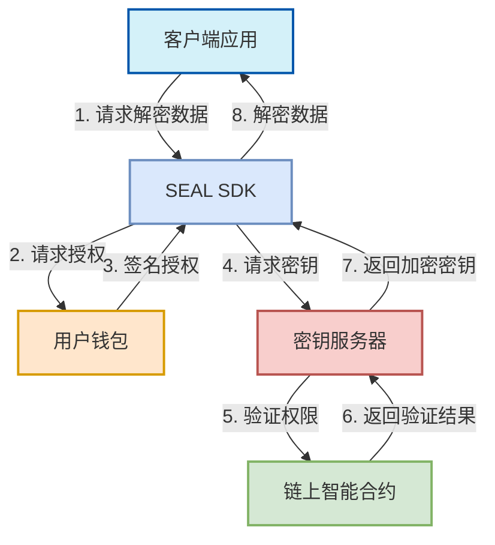
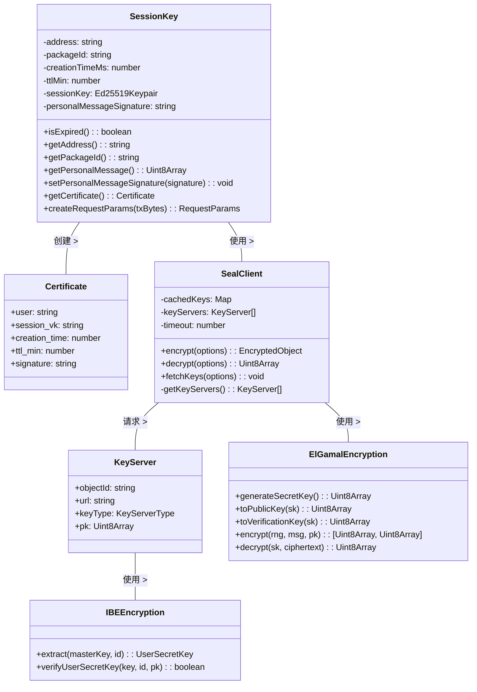
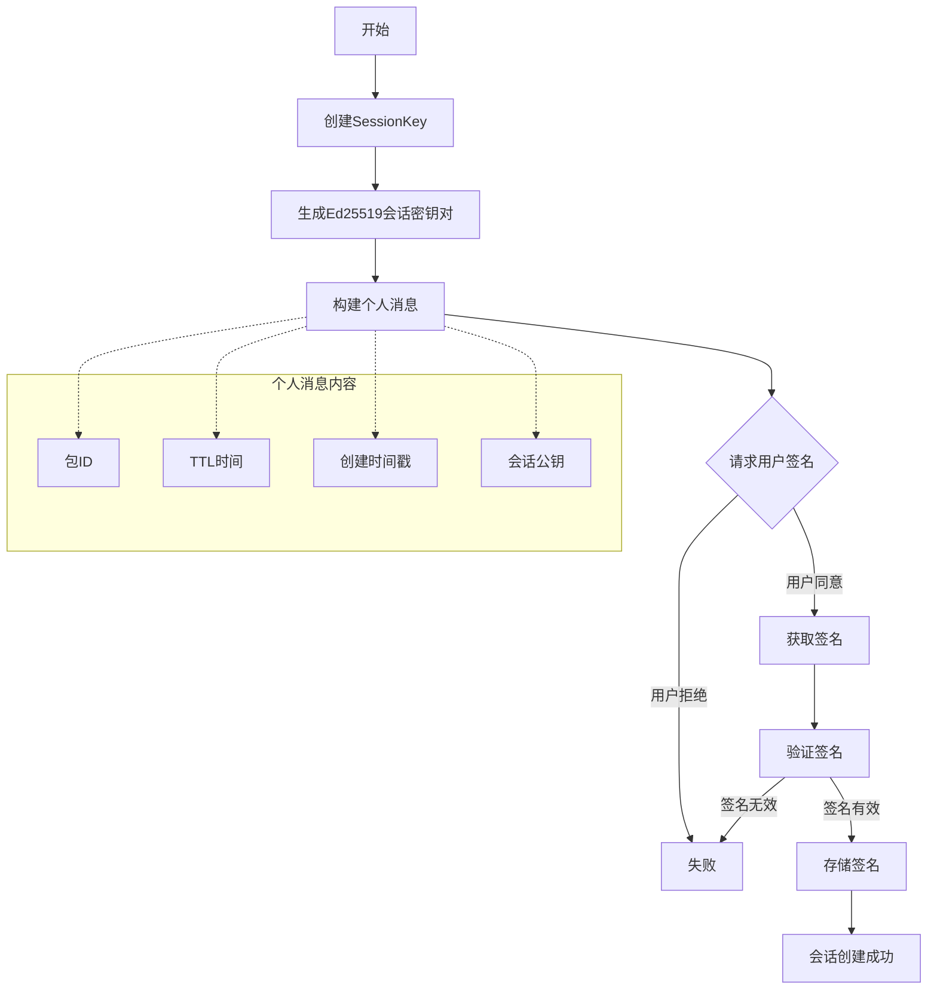
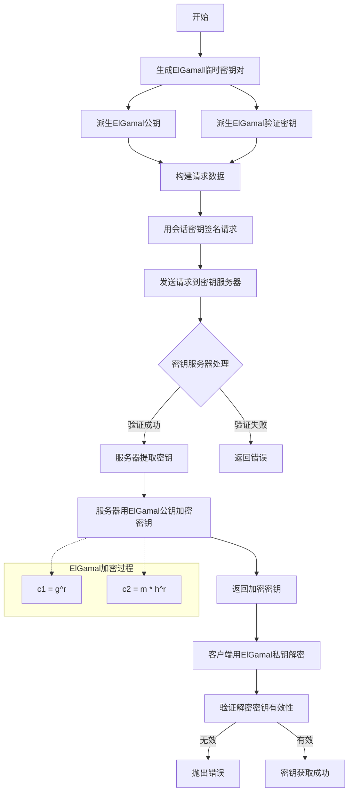
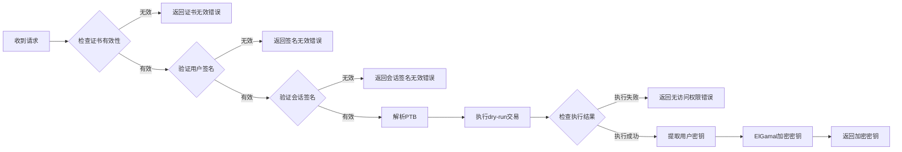
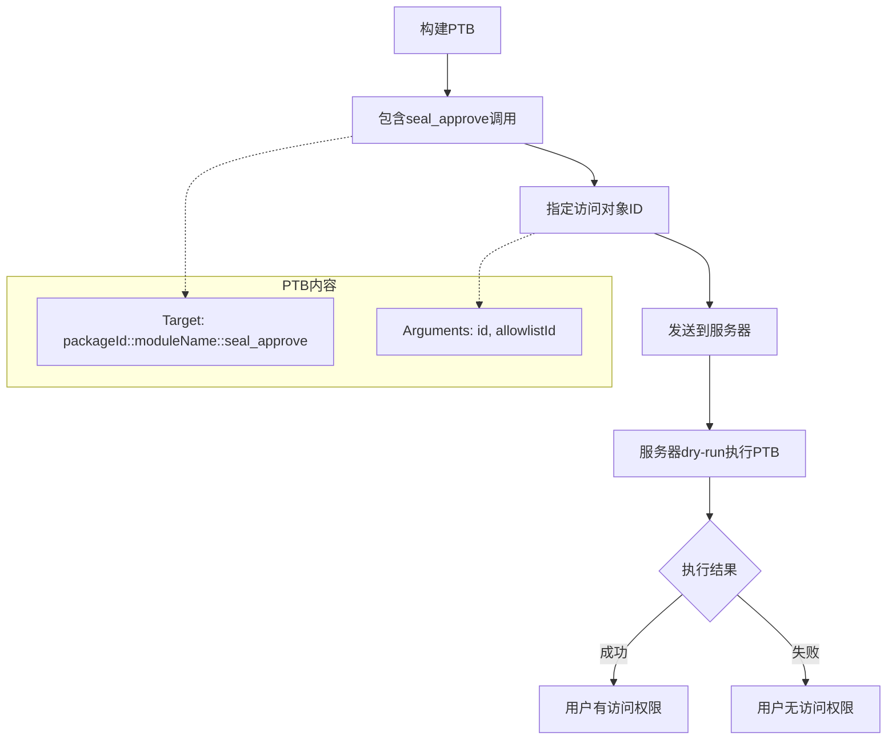
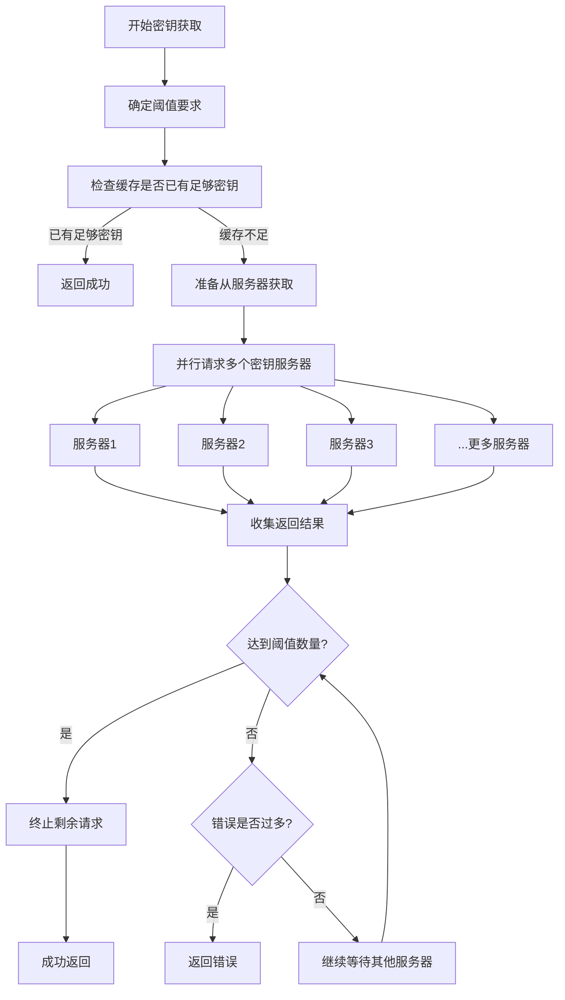
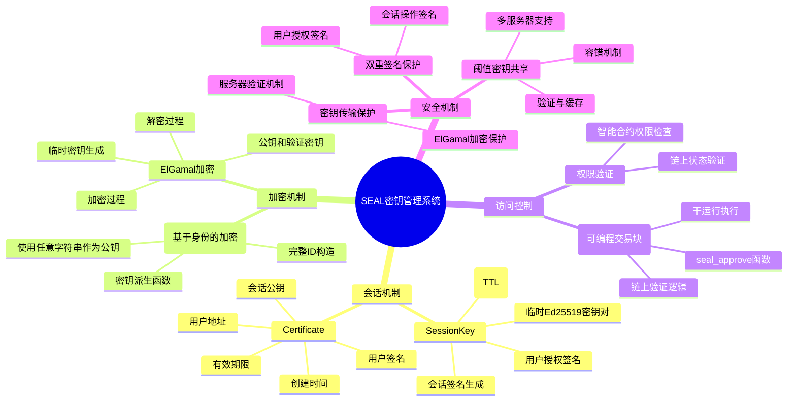
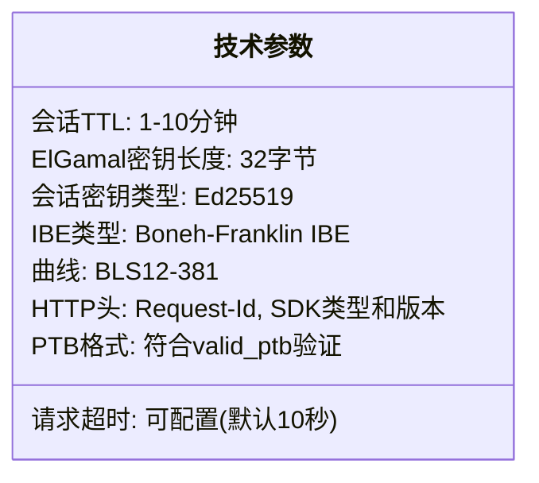

# SEAL 密钥服务系统交互流程技术备忘录

## 1. 整体系统架构



## 2. 详细交互流程


## 3. 重要组件详解



## 4. 关键流程详解

### 4.1 会话创建与授权流程



### 4.2 密钥请求与ElGamal加密流程



### 4.3 密钥服务器验证流程



### 4.4 PTB验证与访问控制流程



### 4.5 阈值密钥获取与容错机制



## 5. 关键概念解释



## 6. 常见问题解答

```mermaid
graph TD
    Q1[PTB是什么?] --> A1[PTB是Sui区块链的可编程交易块<br/>在SEAL中用于验证用户访问权限<br/>包含seal_approve等函数调用]
    
    Q2[为什么使用ElGamal加密?] --> A2[ElGamal是公钥加密系统<br/>可以安全传输密钥<br/>支持同态加密特性<br/>与IBE加密兼容]
    
    Q3[会话密钥如何保障安全?] --> A3[有严格的时间限制(1-10分钟)<br/>需要用户钱包签名授权<br/>会话密钥只在客户端内存中<br/>每个会话独立生成新密钥]
    
    Q4[阈值机制有什么作用?] --> A4[允许从多个服务器获取密钥<br/>只需达到阈值数量即可解密<br/>提高系统可用性和容错性<br/>防止单点故障或恶意服务器]
    
    Q5[用户如何控制谁能解密?] --> A5[通过智能合约定义访问逻辑<br/>可基于任何链上状态控制<br/>如所有权、权限列表、支付状态等<br/>灵活且可编程的访问控制]
```

## 7. 技术参数表

