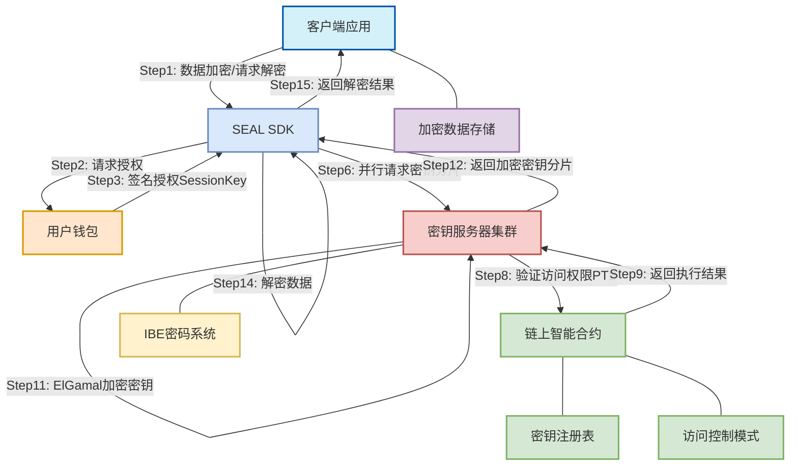
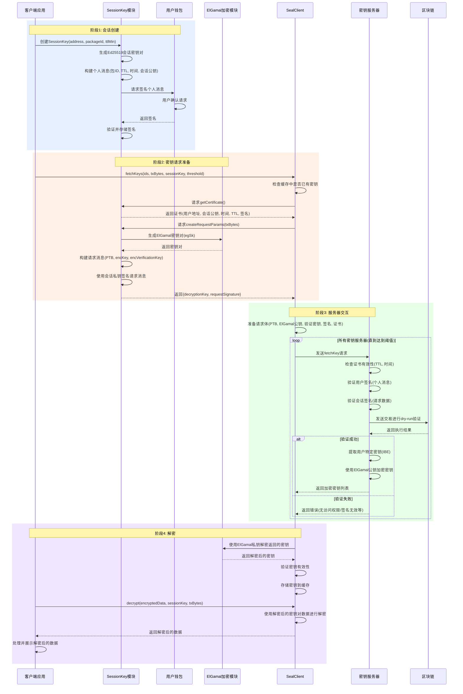
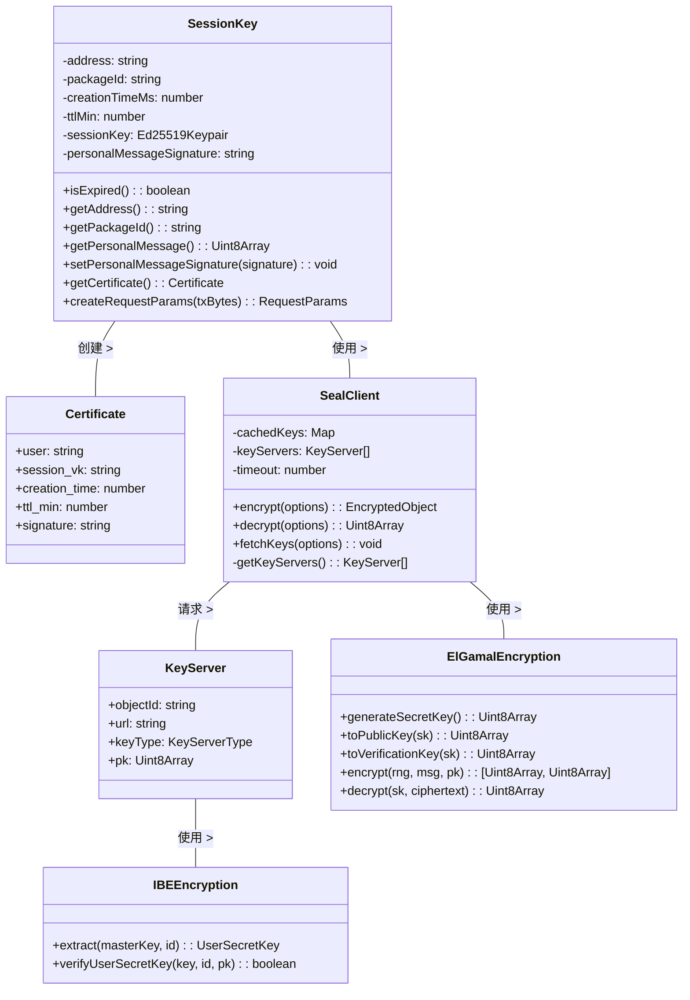
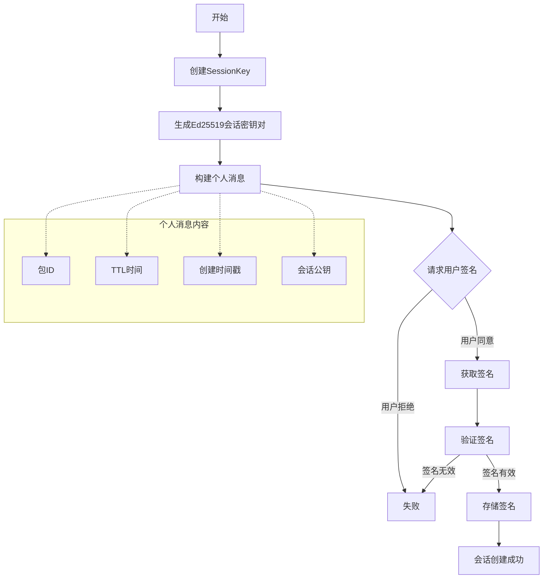
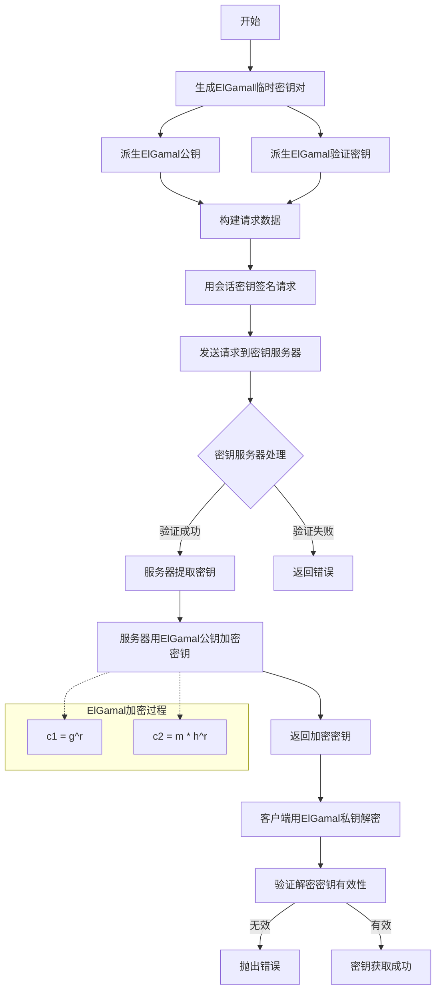
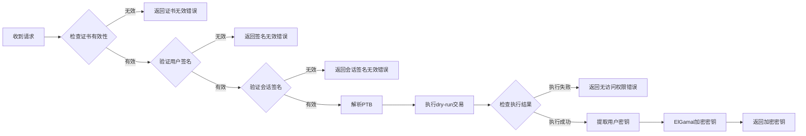
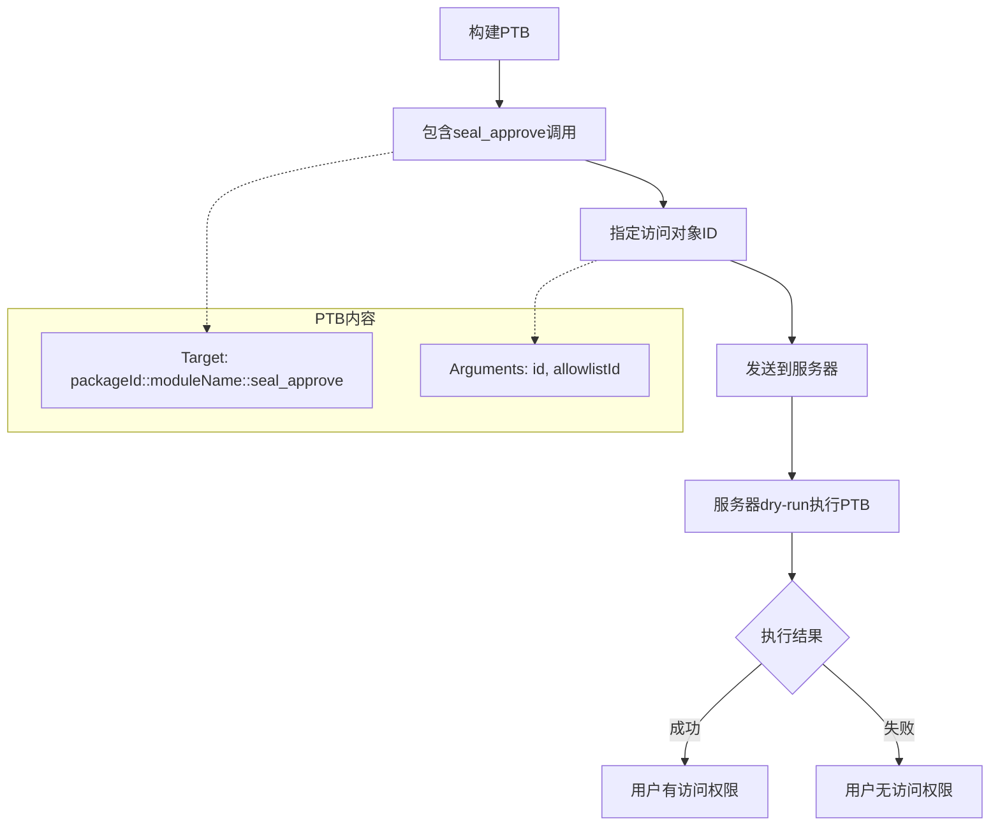
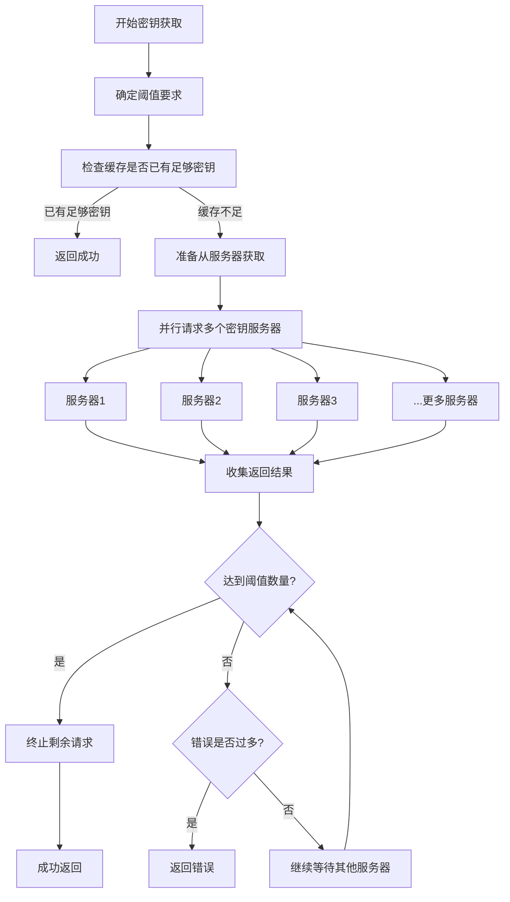
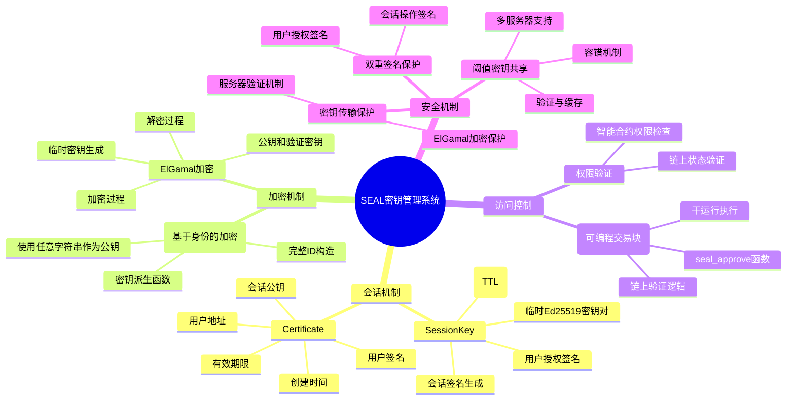

# SEAL 密钥服务系统交互流程技术备忘录

## 1. 整体系统架构

## 2. 详细交互流程

## 3. 重要组件详解

## 4. 关键流程详解

### 4.1 会话创建与授权流程

### 4.2 密钥请求与ElGamal加密流程

### 4.3 密钥服务器验证流程

### 4.4 PTB验证与访问控制流程

### 4.5 阈值密钥获取与容错机制

## 5. 关键概念解释

# SEAL密钥服务系统常见问题(FAQ)

## 一、SessionKey相关问题

### Q1: 什么是SessionKey，它解决了什么问题？
SessionKey是SEAL库中的关键组件，提供临时会话凭证机制，使用户能在限定时间内授权应用程序访问加密数据。它解决了以下核心问题：
- **减少频繁签名**：避免每次解密操作都需要用户确认
- **提高用户体验**：一次授权，多次使用
- **增强安全性**：授权有严格时间限制(1-10分钟)，减少长期授权风险
- **优化资源消耗**：减少链上交互频率，降低系统负载

### Q2: SessionKey的主要组成部分有哪些？
SessionKey包含以下关键属性：
- **用户地址**：与会话关联的Sui地址
- **包ID**：要访问的智能合约包ID
- **创建时间**：会话的创建时间戳
- **TTL(Time-To-Live)**：会话的有效期限（分钟）
- **会话密钥对**：临时生成的Ed25519密钥对
- **个人消息签名**：用户对会话请求的签名

### Q3: SessionKey如何防止滥用？
SessionKey通过多层机制防止滥用：
- **强制时间限制**：会话最长只能存活10分钟
- **用户明确授权**：必须通过钱包显式签名
- **单一包绑定**：每个SessionKey只能访问特定包的密钥
- **过期即失效**：过期后需重新获取用户授权
- **验证链**：密钥服务器验证用户签名和会话签名

## 二、技术选择问题

### Q4: 为什么使用PTB(Programmable Transaction Block)进行权限验证？
PTB作为权限验证机制具有显著优势：
- **灵活的访问控制**：可基于任何链上状态（如NFT所有权、支付状态等）
- **无需信任密钥服务器**：权限逻辑在链上定义，服务器只负责验证
- **可编程性**：支持创建任意复杂的访问规则
- **一致性**：所有密钥服务器使用相同的链上逻辑
- **支持升级**：可升级智能合约以改变访问规则，无需修改服务器

### Q5: 为什么SEAL选择ElGamal加密而非其他加密方案？
ElGamal加密系统在SEAL中的选择基于以下因素：
- **数学兼容性**：与IBE(基于身份的加密)系统共享相同的数学基础
- **一次性密钥特性**：特别适合"用后即弃"的临时会话模型
- **前向安全性**：即使某次通信被破解，不会影响其他会话
- **阈值支持**：适合实现分布式密钥片段重构
- **高效传输**：在相同安全级别下，密钥大小相对较小

### Q6: 为什么SEAL需要双重签名机制？
双重签名机制（用户签名和会话签名）提供多层安全保障：
- **权责分离**：用户签名证明身份和授权，会话签名保护请求完整性
- **防御多种攻击**：抵御中间人攻击、重放攻击和会话劫持
- **最小权限原则**：用户只授权有限的会话权限，而非无限制访问
- **请求绑定**：会话签名将请求内容绑定到会话，防止参数被替换

### Q7: 为什么SEAL实现阈值密钥共享？
阈值机制(t-of-n)提供以下关键优势：
- **安全冗余**：即使部分(n-t)服务器被攻破，系统仍然安全
- **高可用性**：只需任意t个服务器可用，系统即可正常工作
- **去中心化**：避免单一控制点，实现权力分散
- **抗审查**：防止单一实体拒绝提供服务
- **性能优化**：可并行请求多个服务器，选择最快响应

## 三、架构与实现问题

### Q8: SEAL与传统密钥管理系统有何不同？
SEAL系统与传统密钥管理的主要区别：

| 特性 | SEAL系统 | 传统密钥管理 |
|------|----------|------------|
| 访问控制 | 基于链上智能合约 | 基于中心化规则 |
| 用户授权 | 临时会话+钱包签名 | 长期API密钥/令牌 |
| 密钥保护 | 分布式密钥服务器 | 中心化密钥存储 |
| 验证机制 | PTB干运行+双重签名 | API权限检查 |
| 可编程性 | 高度可编程的访问控制 | 预定义的权限规则 |
| 信任模型 | 最小化信任要求 | 依赖服务提供商 |

### Q9: SEAL如何保护密钥在传输过程中的安全？
SEAL通过多层加密和保护机制确保密钥传输安全：
- **ElGamal加密**：服务器使用客户端临时公钥加密返回的密钥
- **HTTPS传输**：所有通信通过TLS加密
- **一次性密钥**：每次请求生成新的ElGamal密钥对
- **请求签名**：每个请求都有会话签名保护
- **状态隔离**：密钥服务器不保存会话状态，降低泄露风险

### Q10: IBE(基于身份的加密)在SEAL中扮演什么角色？
IBE在SEAL系统中的关键作用：
- **灵活的密钥派生**：可以从任意字符串(如对象ID)派生密钥
- **无需预先密钥交换**：密钥服务器可即时生成用户特定密钥
- **紧凑标识符**：使用简单字符串作为加密对象的标识符
- **密钥服务器结构**：支持基于主密钥派生多个用户密钥
- **高效验证**：支持高效的密钥验证算法

## 四、实际使用问题

### Q11: 如何优化SEAL系统的性能？
优化SEAL系统性能的关键策略：
- **密钥缓存**：客户端缓存已获取的密钥，避免重复请求
- **批量密钥获取**：一次请求多个密钥，减少网络往返
- **并行服务器请求**：同时向多个密钥服务器发送请求
- **早期中止**：达到阈值后终止其余请求
- **合理TTL设置**：根据使用场景设置合适的会话有效期

### Q12: SEAL系统适用于哪些应用场景？
SEAL特别适合以下应用场景：
- **加密内容平台**：提供付费或权限控制的内容访问
- **数据市场**：安全共享和交易数据资产
- **保密通信**：端到端加密消息系统
- **多方数据共享**：控制多方之间的数据访问权限
- **去中心化应用**：需要加密存储和条件访问的DApps
- **财务文件保护**：保护对财务和法律文件的访问

### Q13: 如何处理SEAL系统中的错误和异常？
SEAL系统常见错误及处理策略：
- **会话过期**：重新创建SessionKey并获取用户签名
- **权限不足**：检查访问条件，确认用户满足链上要求
- **签名验证失败**：重新请求用户签名，检查钱包地址
- **服务器无响应**：切换到其他密钥服务器，利用阈值机制
- **密钥验证失败**：可能是服务器返回了无效密钥，尝试其他服务器
- **解密失败**：检查密钥是否正确，数据是否完整

### Q14: SEAL系统的安全性如何保障？
SEAL系统的安全保障机制：
- **密码学基础**：基于成熟的椭圆曲线加密和IBE系统
- **链上验证**：权限逻辑在链上执行，不依赖服务器
- **阈值分布**：密钥分散在多个服务器，防止单点攻击
- **时间限制**：所有会话均有严格的时间限制
- **多重签名**：用户签名和会话签名双重验证
- **零状态**：服务器不保存会话状态，降低攻击面

### Q15: SEAL与链上密钥系统的区别是什么？
SEAL与纯链上密钥系统的比较：
- **性能**：SEAL避免了链上解密的高成本，更高效
- **大数据支持**：可处理大型加密数据，不受链上存储限制
- **灵活性**：仅访问控制在链上，加密操作在链下执行
- **隐私性**：加密数据和解密过程完全在链下，增强隐私
- **可扩展性**：可支持更复杂的加密方案和大量数据
- **成本效益**：大幅降低链上交易成本，同时保持链上验证的安全性

这些问答涵盖了SEAL系统的核心概念、技术选择、架构特点和实际应用，为开发者和用户提供全面的参考指南。
