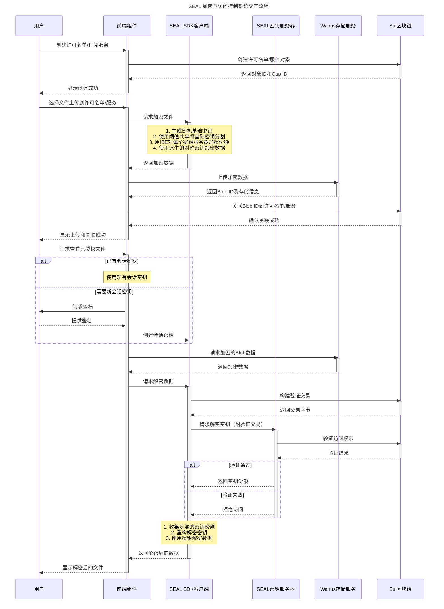

# SEAL 系统集成示例

## 项目概述

本示例展示了如何在前端应用程序中集成 SEAL 加密系统与 Sui 区块链上的智能合约，实现基于区块链的加密数据访问控制。提供了两种访问控制模式：许可名单模式和订阅模式。

## 系统架构

系统由以下主要部分组成：

1. **前端应用程序**：React 应用程序，处理用户交互、文件加密/解密以及与区块链交互
2. **智能合约**：Sui Move 合约，实现访问控制逻辑
3. **SEAL SDK**：处理加密、解密和密钥获取的客户端库
4. **密钥服务器**：验证用户访问权限并分发解密密钥的服务器
5. **Walrus 存储服务**：存储加密数据的服务

## 核心组件说明

### 前端组件

#### 加密和上传 (EncryptAndUpload.tsx)

`WalrusUpload` 组件负责文件加密和上传：

- 允许用户选择文件并选择 Walrus 服务
- 使用 SEAL 客户端加密文件
- 将加密数据上传到 Walrus 存储服务
- 在区块链上将 Blob ID 关联到访问控制对象

```typescript
// 使用SEAL客户端进行加密
const { encryptedObject: encryptedBytes } = await client.encrypt({
  threshold: 2,                // 解密所需的最小密钥服务器数量
  packageId,                   // 包ID
  id,                          // 加密ID，包含策略对象ID和随机nonce
  data: new Uint8Array(result), // 原始数据
});
```

#### 许可名单查看器 (AllowlistView.tsx)

`Feeds` 组件处理加密文件的查看和解密：

- 获取许可名单信息和关联的 Blob ID
- 创建会话密钥并请求用户签名
- 从 Walrus 下载加密数据
- 使用 SEAL 客户端解密数据并显示

```typescript
// 创建新的会话密钥
const sessionKey = new SessionKey({
  address: suiAddress,
  packageId,
  ttlMin: TTL_MIN,
});

// 签名个人消息以授权会话密钥
signPersonalMessage(
  {
    message: sessionKey.getPersonalMessage(),
  },
  {
    onSuccess: async (result) => {
      await sessionKey.setPersonalMessageSignature(result.signature);
      // ...解密流程
    }
  }
);
```

#### 工具函数 (utils.ts)

`downloadAndDecrypt` 函数处理文件下载和解密流程：

- 从 Walrus 聚合器下载加密的 Blob
- 提取所有 Blob 的 ID 并构建批量密钥获取请求
- 使用 SEAL 客户端和会话密钥获取解密密钥
- 解密所有 Blob 并显示内容

```typescript
// 批量获取密钥（每批最多10个）
for (let i = 0; i < validDownloads.length; i += 10) {
  const batch = validDownloads.slice(i, i + 10);
  const ids = batch.map((enc) => EncryptedObject.parse(new Uint8Array(enc)).id);
  
  // 构建验证交易
  const tx = new Transaction();
  ids.forEach((id) => moveCallConstructor(tx, id));
  const txBytes = await tx.build({ client: suiClient, onlyTransactionKind: true });
  
  // 使用SEAL客户端获取解密密钥
  await sealClient.fetchKeys({ ids, txBytes, sessionKey, threshold: 2 });
}
```

### 智能合约

#### 许可名单模块 (allowlist.move)

实现基于许可名单的访问控制，主要功能：

- 创建和管理许可名单
- 添加/删除授权地址
- 验证用户访问权限
- 关联加密数据到许可名单

```move
/// 检查调用者是否有权限访问特定ID
/// 所有在许可名单中的地址都可以访问具有该许可名单前缀的所有ID
fun approve_internal(caller: address, id: vector<u8>, allowlist: &Allowlist): bool {
    // 检查ID是否具有正确的前缀
    let namespace = namespace(allowlist);
    if (!is_prefix(namespace, id)) {
        return false
    };

    // 检查用户是否在许可名单中
    allowlist.list.contains(&caller)
}
```

#### 订阅模块 (subscription.move)

实现基于订阅和时间的访问控制，主要功能：

- 创建和管理订阅服务
- 处理用户订阅付款
- 基于订阅有效期验证访问权限
- 关联加密数据到订阅服务

```move
/// 检查订阅凭证是否有效且可以访问特定ID
fun approve_internal(id: vector<u8>, sub: &Subscription, service: &Service, c: &Clock): bool {
    // 检查订阅的服务ID是否与提供的服务匹配
    if (object::id(service) != sub.service_id) {
        return false
    };
    // 检查订阅是否已过期
    if (c.timestamp_ms() > sub.created_at + service.ttl) {
        return false
    };

    // 检查ID是否具有正确的前缀
    is_prefix(service.id.to_bytes(), id)
}
```

#### 工具函数 (utils.move)

提供辅助功能，例如前缀检查：

```move
/// 检查一个字节向量是否是另一个字节向量的前缀
public(package) fun is_prefix(prefix: vector<u8>, word: vector<u8>): bool {
    // 如果前缀长度大于完整字符串，则不可能是前缀
    if (prefix.length() > word.length()) {
        return false
    };
    let mut i = 0;
    // 逐字节比较前缀和目标字符串
    while (i < prefix.length()) {
        if (prefix[i] != word[i]) {
            return false
        };
        i = i + 1;
    };
    true
}
```

## 交互流程图

下面是 SEAL 系统各组件交互的流程图：



## 访问控制模式

### 许可名单模式

1. **创建阶段**：
   - 创建许可名单和管理员凭证
   - 将特定地址添加到许可名单

2. **加密数据阶段**：
   - 使用 SEAL 客户端加密文件
   - 上传加密数据到 Walrus
   - 关联 Blob ID 到许可名单

3. **解密阶段**：
   - 用户尝试访问加密数据
   - 系统验证用户地址是否在许可名单中
   - 如果验证通过，允许获取解密密钥

### 订阅模式

1. **创建阶段**：
   - 创建订阅服务，设置费用和有效期
   - 获取服务管理员凭证

2. **加密数据阶段**：
   - 与许可名单模式相同

3. **用户订阅阶段**：
   - 用户支付订阅费用
   - 获取订阅 NFT 凭证，记录创建时间

4. **解密阶段**：
   - 用户尝试访问加密数据
   - 系统验证用户拥有有效的订阅凭证且未过期
   - 如果验证通过，允许获取解密密钥

## 安全特性

1. **分布式密钥管理**：
   - 使用阈值密钥共享，需要多个密钥服务器协作
   - 没有单点故障，提高系统安全性

2. **链上访问控制**：
   - 所有访问控制逻辑在 Sui 区块链上验证
   - 不可篡改和透明的权限管理

3. **会话密钥**：
   - 临时密钥有时间限制
   - 每次使用需要用户签名授权

4. **数据隔离**：
   - 每个加密对象有唯一的密钥
   - 基于前缀命名空间实现数据隔离

5. **精细访问控制**：
   - 可以按个人、组或付费模式控制访问权限
   - 支持基于时间的访问权限管理

## 部署和使用

详细的部署和使用说明请参考各目录下的文档：

- **前端**：`frontend/` 目录
- **智能合约**：`move/` 目录
- **SDK**：请参考 `@mysten/seal` 的文档

## 技术亮点

- 结合了区块链的不可篡改性和密码学的安全性
- 实现了完全去中心化的访问控制系统
- 集成了前端、区块链和密钥服务器的完整解决方案
- 支持多种灵活的访问控制模型
- 不将加密数据存储在区块链上，提高了效率和隐私性

## 潜在应用场景

- 付费内容平台
- 私人文档共享
- 安全数据交换
- 去中心化媒体发布
- 机密商业数据共享
- NFT 解锁的专属内容
- DAO 内部文档管理
