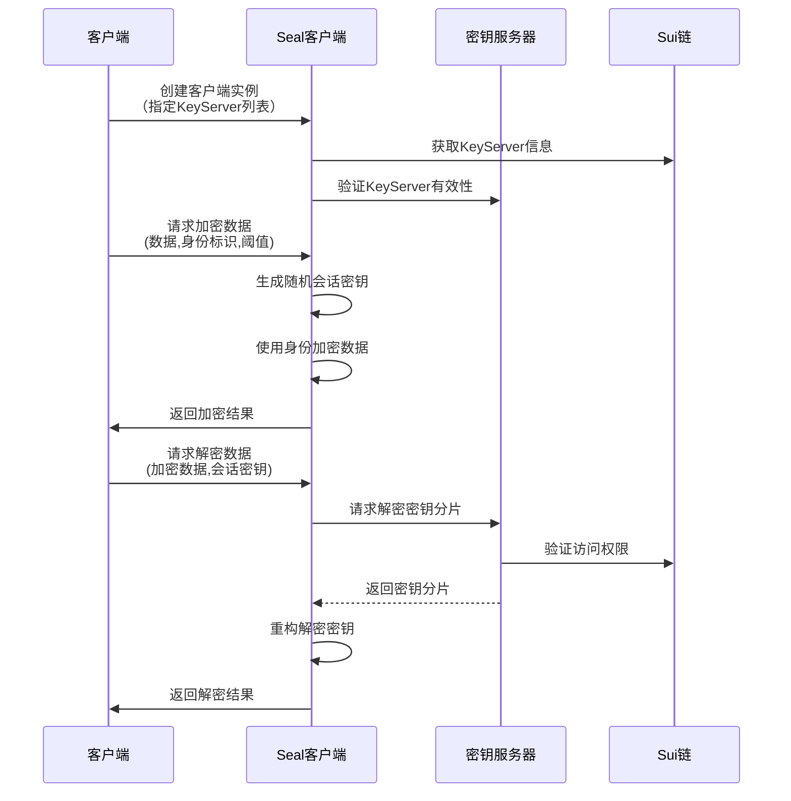

# Seal SDK 架构文档

## 功能泳道图



## 核心组件

1. **SealClient**
   - 主要客户端接口
   - 管理密钥服务器连接
   - 处理加密/解密请求
   
2. **KeyServer**
   - 密钥存储和管理
   - 权限验证
   - 密钥分发

3. **SessionKey**
   - 会话管理
   - 临时密钥生成
   - 签名验证

4. **加密组件**
   - IBE (Identity-Based Encryption)
   - AES-GCM / HMAC-CTR
   - Shamir密钥分享

## 数据流

1. **加密流程**
   ```
   原始数据 -> DEM加密 -> IBE加密 -> 密钥分片 -> 加密对象
   ```

2. **解密流程**
   ```
   加密对象 -> 收集密钥分片 -> 重构密钥 -> IBE解密 -> DEM解密 -> 原始数据
   ```

## 安全特性

1. 基于身份的加密(IBE)
2. 门限密钥分享(t-n)
3. 零知识证明
4. 访问控制
5. 防重放攻击
```
