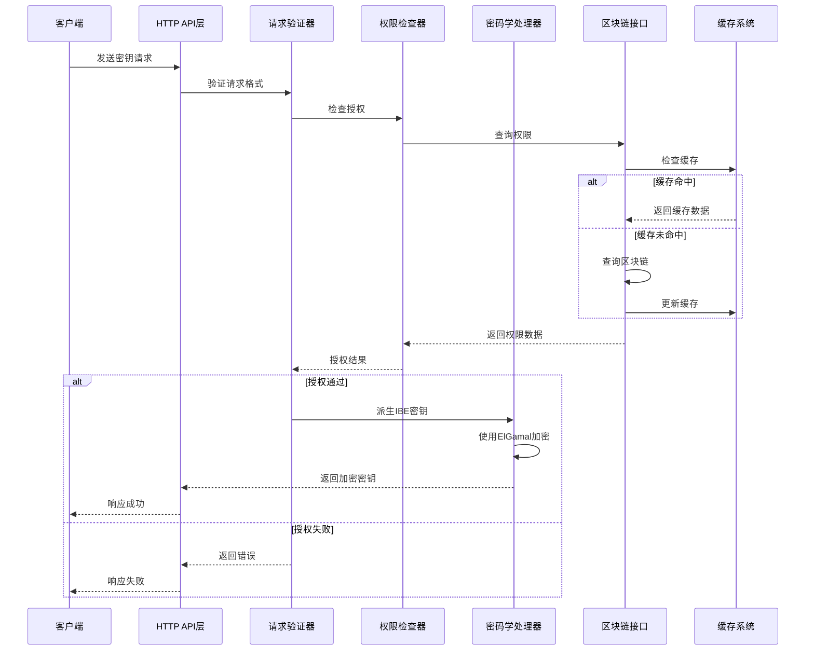
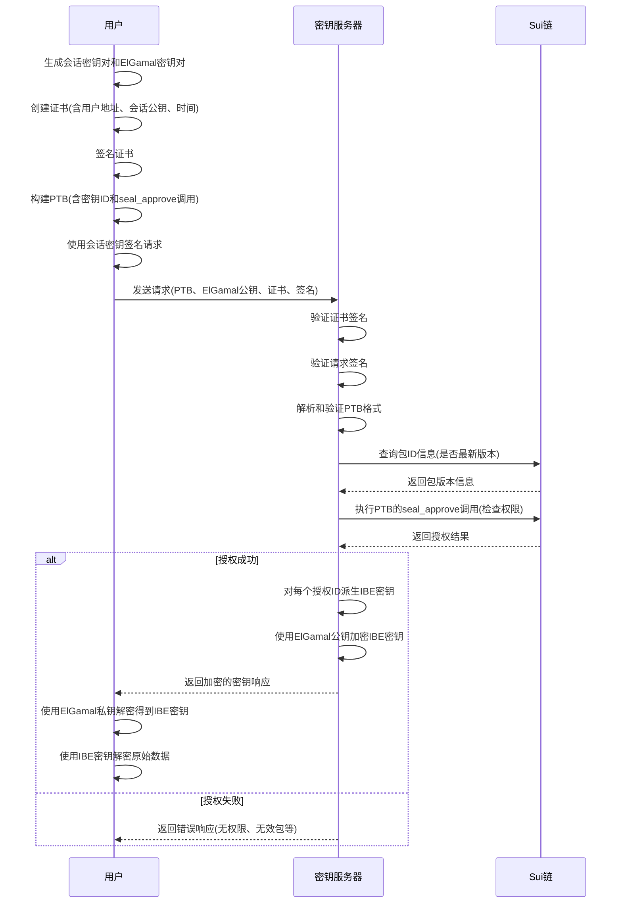

# Seal 密钥服务器

## 项目概述

Seal密钥服务器是基于身份的加密(IBE)系统的核心组件，负责安全地向授权用户分发加密密钥。本服务器实现了严格的身份验证和访问控制机制，确保只有经过授权的用户能够获取解密密钥，从而保护敏感数据的安全性。系统设计注重安全性、可扩展性、高性能和可维护性。

## 核心功能与特性

- **安全的密钥分发**：实施多层验证，确保密钥只发放给授权用户
- **多重身份验证机制**：基于数字签名、证书和Sui区块链的身份验证
- **灵活的访问控制模式**：支持白名单、私有数据、时间限制执行等七种访问模式
- **高性能处理**：异步架构、高效缓存和并行处理能力
- **可扩展性**：模块化设计，支持水平扩展
- **可观测性**：全面的性能指标监控和审计日志
- **安全通信**：使用ElGamal加密确保通信安全
- **包版本管理**：自动验证和强制使用最新的智能合约版本

## 系统架构

### 架构概览

密钥服务器采用模块化设计，各组件职责明确，便于维护和扩展。系统架构如下图所示：

```
+-------------------+     +-------------------+     +-------------------+
|                   |     |                   |     |                   |
|  HTTP API 层      |---->|  请求处理与验证   |---->|  IBE密钥派生      |
|                   |     |                   |     |                   |
+-------------------+     +-------------------+     +-------------------+
         |                        |                         |
         |                        |                         |
         v                        v                         v
+-------------------+     +-------------------+     +-------------------+
|                   |     |                   |     |                   |
|  指标收集         |     |  验证与权限检查   |     |  外部接口        |
|                   |     |                   |     |                   |
+-------------------+     +-------------------+     +-------------------+
                                    |
                                    |
                                    v
                          +-------------------+
                          |                   |
                          |  缓存系统         |
                          |                   |
                          +-------------------+
```

### 核心模块概述

系统由以下核心模块组成，每个模块有明确的职责：

1. **Server (`server.rs`)**
   - 系统主入口，提供HTTP API和请求处理主流程
   - 管理服务器状态和资源，包括密钥存储和客户端连接
   - 实现异步请求处理和响应生成

2. **错误处理 (`errors.rs`)**
   - 定义密钥服务器的错误类型和处理机制
   - 提供错误-HTTP状态码映射，确保适当的客户端反馈
   - 支持结构化错误日志记录和指标收集

3. **外部接口 (`externals.rs`)**
   - 管理与外部系统（如Sui区块链）的交互
   - 实现包ID验证、区块链状态查询和时间管理功能
   - 提供缓存机制以减少外部调用频率

4. **签名消息 (`signed_message.rs`)**
   - 生成和验证用于用户证书的消息格式
   - 实现请求签名数据格式和处理
   - 确保通信安全和防篡改

5. **类型定义 (`types.rs`)**
   - 定义服务器使用的基础数据类型
   - 封装IBE和ElGamal加密相关的类型
   - 提供网络环境配置和环境适配

6. **交易验证 (`valid_ptb.rs`)**
   - 验证客户端提交的可编程交易块(PTB)
   - 确保PTB结构符合安全要求和访问控制规则
   - 提取和验证密钥ID和权限证明

7. **缓存系统 (`cache.rs`)**
   - 实现高性能LRU缓存，优化频繁访问的数据
   - 支持自动过期机制和线程安全操作
   - 缓存包版本信息、链上状态以提高性能

8. **性能监控 (`metrics.rs`)**
   - 收集和暴露系统性能指标
   - 支持Prometheus集成，便于监控和告警
   - 提供请求耗时、错误率和资源使用率等关键指标

### 数据流与组件交互



## 密钥请求处理流程

### 完整请求流程

1. **用户准备阶段**
   - 用户生成临时会话密钥对
   - 创建并签名证书(Certificate)，包含用户地址、会话公钥、创建时间和TTL
   - 生成ElGamal密钥对用于安全通信

2. **请求构建**
   - 创建符合Seal规范的可编程交易块(PTB)
   - 将PTB与ElGamal公钥和验证密钥一起打包
   - 使用会话私钥签名请求

3. **服务器处理**
   - 验证请求格式和证书有效性
   - 验证会话密钥签名
   - 解析和验证PTB结构和内容
   - 检查用户权限（通过区块链交互）
   - 提取请求的密钥ID

4. **密钥生成与响应**
   - 对每个授权的密钥ID，派生相应的IBE用户密钥
   - 使用用户的ElGamal公钥加密这些IBE密钥
   - 构建包含加密密钥的响应
   - 返回加密的密钥给用户

5. **用户解密**
   - 用户使用ElGamal私钥解密得到IBE密钥
   - 使用IBE密钥解密原始加密数据

### 关键数据结构

#### 证书(Certificate)
```rust
struct Certificate {
    pub user: SuiAddress,           // 用户的Sui地址
    pub session_vk: Ed25519PublicKey, // 会话验证密钥
    pub creation_time: u64,         // 创建时间（Unix时间戳）
    pub ttl_min: u16,               // 生存时间（分钟）
    pub signature: GenericSignature, // 用户签名
}
```

#### 密钥请求(FetchKeyRequest)
```rust
struct FetchKeyRequest {
    ptb: String,                      // 可编程交易块
    enc_key: ElGamalPublicKey,        // ElGamal加密公钥
    enc_verification_key: ElgamalVerificationKey, // ElGamal验证密钥
    request_signature: Ed25519Signature, // 请求签名
    certificate: Certificate,          // 用户会话证书
}
```

#### 密钥响应(FetchKeyResponse)
```rust
struct FetchKeyResponse {
    decryption_keys: Vec<DecryptionKey>, // 解密密钥列表
}

struct DecryptionKey {
    id: KeyId,                      // 密钥标识符
    encrypted_key: ElgamalEncryption, // 加密的密钥
}
```

### 请求流程图示



## 安全机制

密钥服务器采用多层安全机制，确保密钥分发的安全性：

### 身份验证与授权

1. **多层签名验证**
   - 用户证书签名：验证用户身份和授权会话密钥
   - 会话密钥签名：验证请求的完整性和真实性
   - 主密钥证明(POP)：证明服务器持有有效的主密钥

2. **访问控制策略**
   - 白名单访问控制：限制只有白名单中的用户可访问
   - 私有数据访问控制：确保只有数据所有者能访问
   - 时间限制执行：基于时间的访问控制
   - 基于账户的访问控制：只有地址所有者可访问
   - 密钥请求模式：通过链上验证授权访问
   - 订阅模式：基于有效订阅的访问控制
   - 投票机制：支持复杂的投票和多方决策

3. **安全时间管理**
   - 证书时间验证：防止过期或未来证书
   - 定期更新链上时间戳：确保时间参考准确性
   - 防重放攻击：验证请求新鲜度

### 加密协议

1. **IBE加密**
   - 基于Boneh-Franklin BLS12-381曲线实现
   - 支持任意字符串作为加密公钥
   - 实现密钥派生函数(KDF)增强安全性

2. **ElGamal加密**
   - 用于安全传输IBE用户密钥
   - 集成验证功能防止中间人攻击
   - 使用临时会话密钥减少风险

3. **通信安全**
   - HTTPS加密传输层
   - 结构化请求签名
   - 防篡改机制

## 性能优化

密钥服务器采用多种优化策略确保高性能运行：

### 缓存系统

1. **LRU缓存实现**
   - 固定大小（默认1000条目）的LRU缓存
   - 自动过期机制（默认3分钟TTL）
   - 线程安全设计，支持并发访问

2. **缓存内容**
   - 包ID信息：减少GraphQL API调用
   - 检查点时间戳：减少区块链查询
   - 参考Gas价格：优化交易定价

### 异步处理

1. **Tokio异步运行时**
   - 非阻塞IO操作
   - 任务调度与管理
   - 异步锁与同步原语

2. **并行处理**
   - 并行验证多个密钥ID
   - 后台更新器异步更新状态
   - 响应式处理模型

### 资源管理

1. **连接池**
   - 优化区块链节点连接复用
   - 限制最大并发连接数

2. **内存优化**
   - 结构体内存布局优化
   - 避免不必要的克隆和复制
   - 使用引用和借用减少内存分配

## 可观测性与监控

密钥服务器提供全面的监控能力，便于运维和性能优化：

### 指标收集

1. **请求指标**
   - 总请求数和服务请求数
   - 按类型划分的错误计数
   - 请求处理时间分布

2. **性能指标**
   - 外部调用延迟
   - 缓存命中率
   - 关键操作持续时间

3. **状态指标**
   - 外部API调用成功/失败率
   - 验证通过/拒绝比例
   - 资源使用情况

### Prometheus集成

所有指标都以Prometheus格式暴露，支持以下功能：

1. **直方图**：测量操作耗时分布
2. **计数器**：记录事件发生次数
3. **标签**：按维度分类指标数据

### 日志与追踪

1. **结构化日志**
   - 关键操作记录
   - 错误详情与上下文
   - 请求处理生命周期

2. **分布式追踪**
   - 请求ID贯穿全流程
   - 组件间调用关系
   - 性能瓶颈分析

## 测试框架

Seal密钥服务器拥有全面的测试框架，验证系统各方面功能和性能：

### 测试架构

1. **SealTestCluster**
   - 封装Sui测试集群
   - 管理测试密钥服务器和用户
   - 提供合约部署和升级功能

2. **测试用例类型**
   - 端到端测试：验证完整流程
   - 访问控制测试：验证七种权限模式
   - 后台功能测试：验证更新机制
   - 包升级测试：验证版本管理
   - 单元测试：验证模块功能

### 访问控制模式测试

支持七种访问控制模式的测试：

1. **白名单模式**：验证白名单成员访问和非成员限制
2. **私有数据模式**：验证所有者访问和非所有者限制
3. **时间限制执行**：验证基于时间的访问控制
4. **基于账户模式**：验证地址所有者对应的访问控制
5. **密钥请求模式**：验证基于链上策略的访问控制
6. **订阅模式**：验证基于订阅的时效性访问控制
7. **投票机制**：验证多方投票和解密过程

### 性能与压力测试

1. **吞吐量测试**：验证最大请求处理能力
2. **延迟测试**：测量请求处理时间
3. **并发测试**：验证并发处理能力
4. **资源消耗**：监控CPU和内存使用

## 部署与运维

### 环境要求

- Rust 1.70+
- 有效的网络连接以访问Sui区块链
- (可选) Prometheus服务器用于监控

### 配置参数

服务器配置通过环境变量设置:

```bash
# 网络选择: mainnet, testnet, devnet 或 custom
export NETWORK=mainnet

# 如果使用custom网络，需要设置这些URL
export NODE_URL=https://your-sui-node-url
export GRAPHQL_URL=https://your-graphql-url

# 主密钥配置 (实际部署时请使用安全的密钥管理方案)
export MASTER_KEY=your-hex-encoded-master-key
export KEY_SERVER_OBJECT_ID=0x...

# 服务器端口
export PORT=8080

# 指标端口
export PROMETHEUS_PORT=9184
```

### 构建与运行

从源码构建:

```bash
cd server-sourcecode/crates/key-server
cargo build --release
```

运行服务器:

```bash
cargo run --release
```

### Docker支持

使用Docker镜像构建和运行:

```bash
# 构建镜像
docker build -t seal-key-server .

# 运行容器
docker run -p 8080:8080 -p 9184:9184 \
  -e NETWORK=mainnet \
  -e MASTER_KEY=your-hex-encoded-master-key \
  -e KEY_SERVER_OBJECT_ID=0x... \
  seal-key-server
```

### 扩展部署

对于生产环境，建议以下部署策略:

1. **负载均衡**：部署多个服务器实例，通过负载均衡分发请求
2. **高可用性**：跨区域部署，确保服务可用性
3. **监控集成**：接入Prometheus、Grafana进行监控
4. **安全密钥管理**：使用HSM或密钥管理系统保护主密钥

## 未来扩展

密钥服务器设计支持以下扩展方向：

1. **高级访问控制**：更复杂的条件组合和基于角色的访问控制
2. **联邦身份集成**：与外部身份提供者集成
3. **主密钥轮换**：安全无缝地更新主密钥
4. **更多加密算法**：支持后量子密码学算法
5. **跨链支持**：扩展到其他区块链平台

## 贡献指南

我们欢迎社区贡献，请遵循以下步骤:

1. Fork 仓库
2. 创建功能分支 (`git checkout -b feature/amazing-feature`)
3. 提交更改 (`git commit -m 'Add some amazing feature'`)
4. 推送到分支 (`git push origin feature/amazing-feature`)
5. 打开 Pull Request

## 许可证

Apache License 2.0 - 详情请参阅 [LICENSE](./LICENSE) 文件。
