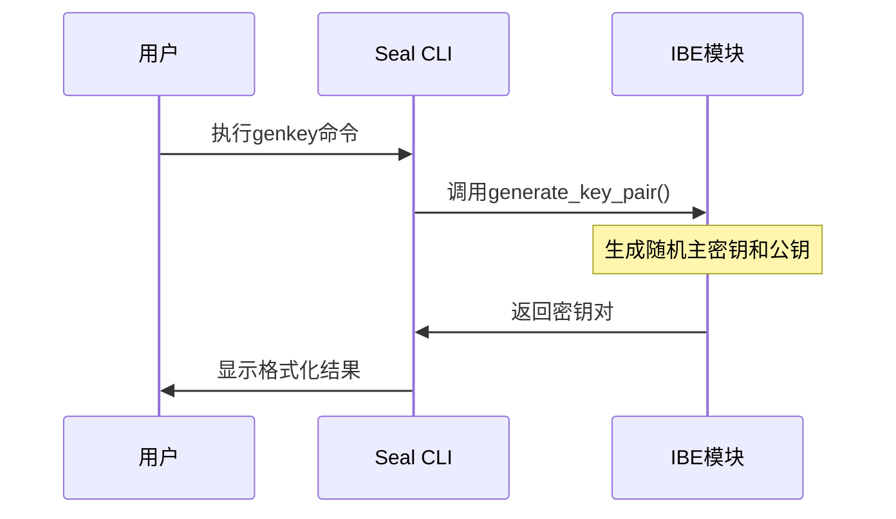
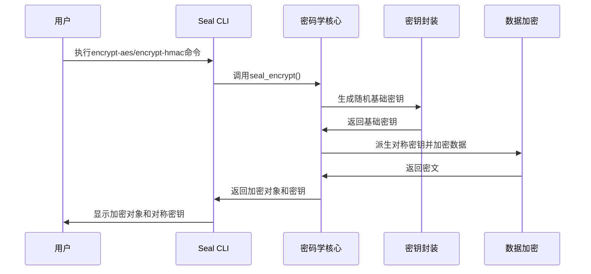
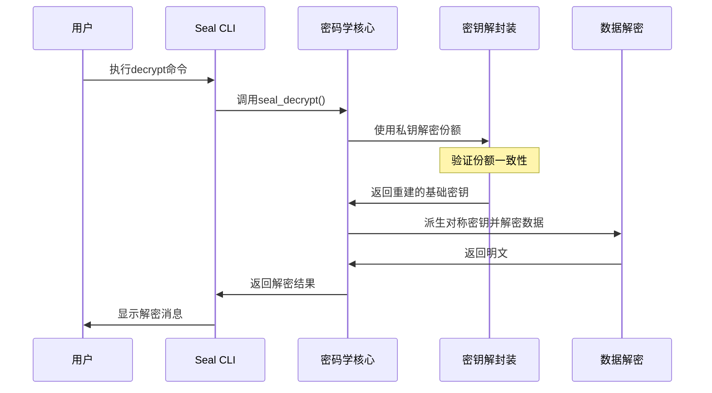
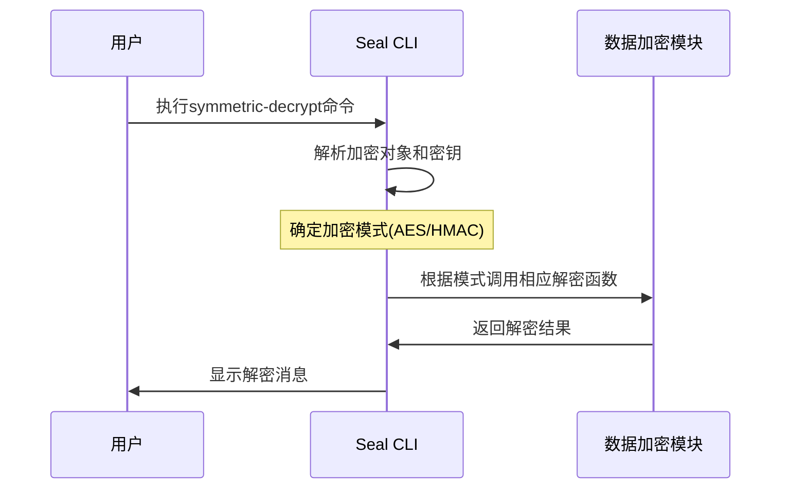
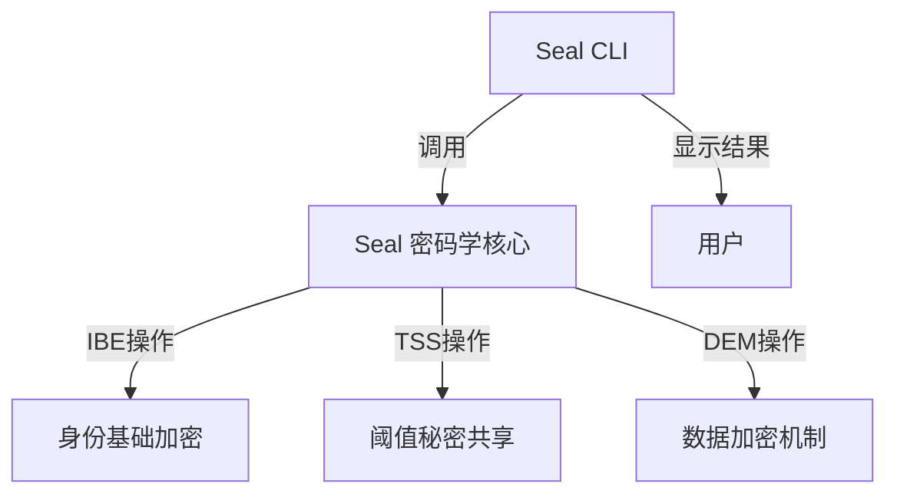

# Seal CLI - 密钥管理系统命令行工具

这是 Seal 密钥管理系统的命令行接口实现，允许用户通过命令行与 Seal 密码学系统进行交互。Seal CLI 提供了一套完整的工具来生成密钥、加密和解密数据，以及管理加密对象。

## 功能概述

Seal CLI 支持以下主要功能：

1. **密钥管理**
   - 生成 IBE 主密钥和公钥对
   - 从主密钥和用户 ID 提取用户私钥
   - 验证用户私钥是否与公钥匹配

2. **加密操作**
   - 使用 Seal 派生密钥（明文模式）
   - 使用 AES-256-GCM 加密消息
   - 使用 HMAC-256-CTR 加密消息

3. **解密操作**
   - 使用密钥服务器私钥解密加密对象
   - 使用派生的对称密钥直接解密

4. **加密对象解析**
   - 查看加密对象的内部结构和组件

## 使用方法

### 安装

```bash
cargo build --release
```

### 基本命令

以下是一些常用命令示例：

#### 生成新的主密钥和公钥

```bash
seal-cli genkey
```

输出：
```
主密钥: <hex编码的主密钥>
公钥: <hex编码的公钥>
```

#### 提取用户私钥

```bash
seal-cli extract --package-id <object_id> --id <hex编码的ID> --master-key <hex编码的主密钥>
```

输出：
```
用户私钥: <hex编码的用户私钥>
```

#### 使用 AES-256-GCM 加密消息

```bash
seal-cli encrypt-aes --message <hex编码的消息> --package-id <object_id> --id <hex编码的ID> --threshold <阈值> <公钥列表> <object_id列表>
```

输出：
```
加密对象 (BCS编码): <hex编码的加密对象>
对称密钥: <hex编码的对称密钥>
```

#### 解密消息

```bash
seal-cli decrypt <hex编码的加密对象> <私钥列表> <object_id列表>
```

输出：
```
解密消息: <hex编码的原始消息>
```

#### 查看加密对象结构

```bash
seal-cli parse <hex编码的加密对象>
```

## 架构设计

Seal CLI 是 Seal 密码学核心库的前端封装，提供了友好的命令行界面。它主要包含以下模块：

1. **命令解析模块** - 使用 clap 库定义和处理命令行参数
2. **核心操作模块** - 调用 Seal 密码学库进行实际的加密解密操作
3. **输出格式化模块** - 处理和展示命令执行结果

## 命令流程图

### 密钥生成流程



### 加密流程



### 解密流程



### 对称解密流程



## 与 Seal 密码学核心的集成

Seal CLI 与 Seal 密码学核心紧密集成，它不包含任何密码学实现，而是作为一个用户友好的接口来访问核心库的功能。以下是主要集成点：



## 安全考虑

使用 Seal CLI 时需要注意以下安全事项：

1. **主密钥保护** - 主密钥应安全存储，因为它可以用于派生所有用户私钥
2. **对称密钥处理** - 加密操作返回的对称密钥应安全存储
3. **命令行历史** - 注意清除包含敏感信息的命令行历史记录
4. **阈值设置** - 根据安全需求设置合适的阈值，平衡安全性和可用性

## 扩展 Seal CLI

如果需要扩展 Seal CLI 的功能，可以按照以下步骤：

1. 在 `Command` 枚举中添加新的命令定义
2. 实现相应的处理逻辑和结果格式化
3. 添加必要的文档和帮助信息

## 故障排除

常见问题及解决方案：

1. **密钥格式错误** - 确保所有密钥和ID使用正确的Hex编码格式
2. **解密失败** - 检查是否提供了足够数量的正确私钥
3. **阈值设置问题** - 确保阈值不大于提供的密钥服务器数量

## 许可证

Apache-2.0 