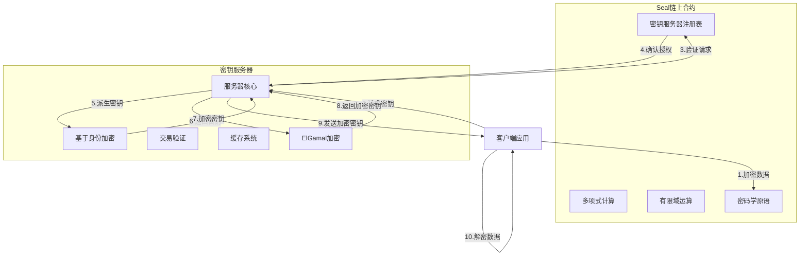
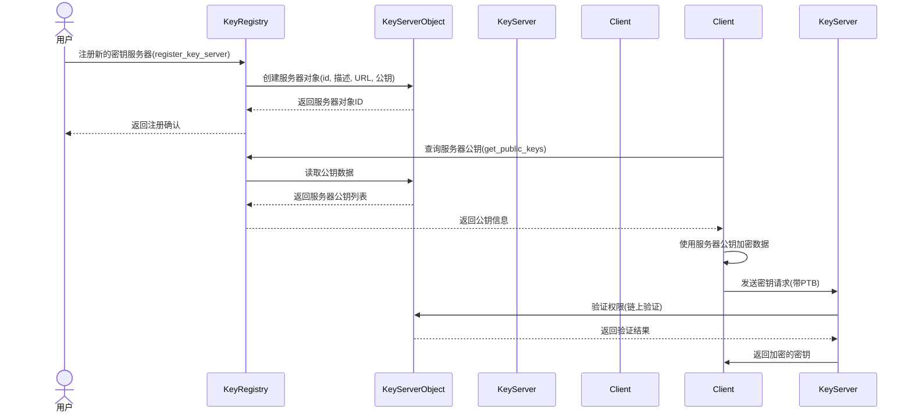
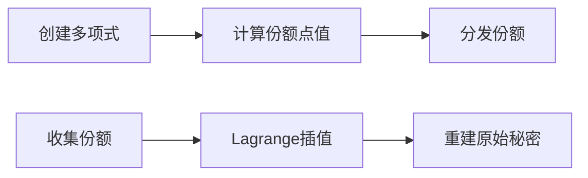
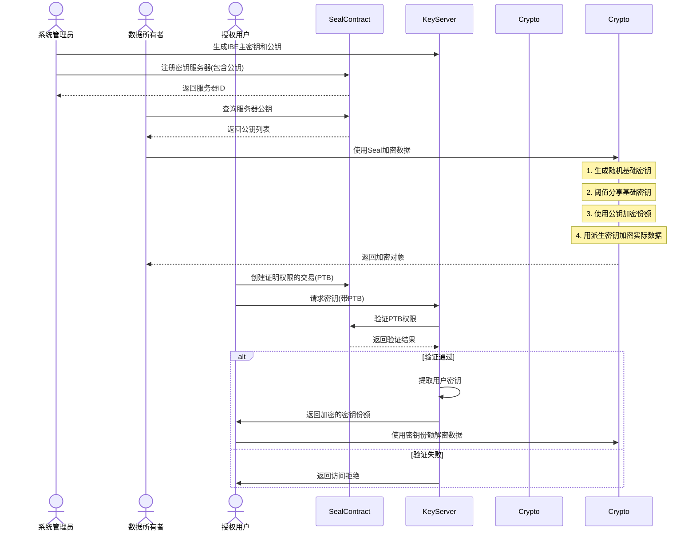
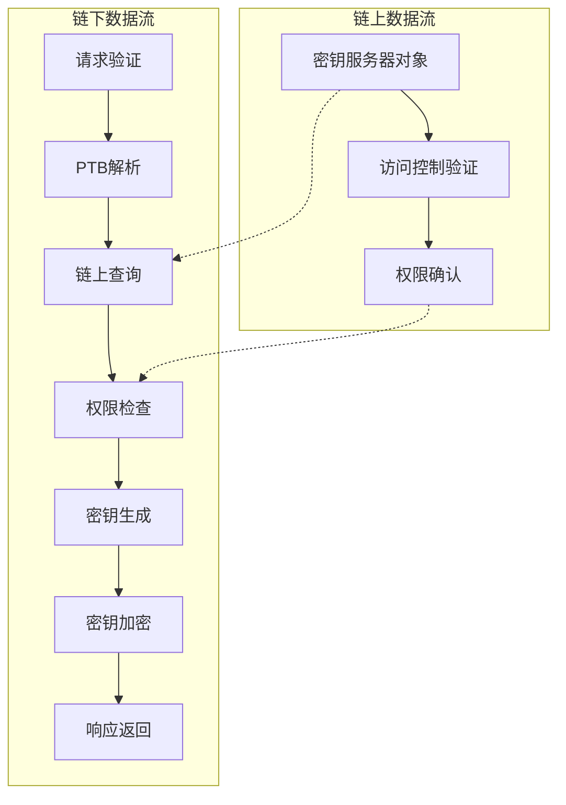

# Seal 密钥管理系统 - 核心模块

> 部署地址: seal:0x2845082f5a5f65756b583e59a9d994aaaa36e7fef7eff5797ab1969921544646

## 1. 模块概述

Seal核心模块实现了密钥管理系统的基础架构，提供密钥服务器注册、密钥派生、多项式处理和有限域运算等关键功能。该模块是整个Seal系统的基础，与链下服务器紧密协作，共同构建了一个安全、可扩展的密钥管理生态系统。

## 2. 系统架构

Seal系统采用混合架构，链上合约负责身份验证、访问控制和密钥服务器管理，而链下服务器负责密钥生成和安全分发。

### 2.1 链上链下协作架构



### 2.2 核心组件交互图



## 3. 核心模块详解

### 3.1 密钥服务器注册表 (`key_registry.move`)

此模块管理Seal系统中所有密钥服务器的注册、更新和查询。

**主要功能：**
- 注册新的密钥服务器
- 更新服务器信息(URL, 描述)
- 查询服务器公钥
- 验证服务器权限

**关键方法：**
```move
/// 注册新密钥服务器
public fun register_key_server(
    _: &mut TxContext,
    description: vector<u8>,
    url: vector<u8>,
    public_key: vector<u8>,
): (ID, KeyServer) { ... }

/// 获取公钥列表
public fun get_public_keys(registry: &KeyRegistry, ids: vector<ID>): vector<vector<u8>> { ... }
```

**与链下服务器的交互：**
- 链下服务器启动时会验证自己是否已在链上注册
- 客户端会从链上获取服务器公钥，用于加密数据
- 服务器处理密钥请求前会验证链上权限

### 3.2 有限域计算 (`gf256.move`)

实现GF(256)有限域上的数学运算，为多项式计算和秘密共享提供基础。

**主要功能：**
- GF(256)域上的加法、乘法、除法运算
- 多项式求值
- 域元素的序列化和表示

**与链下服务器的交互：**
- 链下服务器和链上合约使用相同的有限域运算规则
- 确保阈值密钥共享计算的一致性

### 3.3 多项式处理 (`polynomial.move`)

提供多项式操作和拉格朗日插值功能，用于阈值秘密共享实现。

**主要功能：**
- 多项式求值和插值
- Lagrange系数计算
- 阈值重建支持

**工作原理：**


### 3.4 密码学原语 (`crypto.move`)

提供哈希函数和基础密码学操作。

**主要功能：**
- 安全哈希计算
- 字节数组操作
- ID构建和验证

**与链下服务器的交互：**
- 链下服务器使用相同的哈希函数创建和验证请求
- 确保ID计算和验证的一致性

## 4. 密钥生命周期

下图展示了从密钥服务器注册到密钥使用的完整生命周期：



## 5. 与链下服务器的数据流



## 6. 安全考量

Seal核心模块实现了多层安全机制：

1. **密钥隔离**：主密钥仅存在于链下服务器，链上只存储公钥
2. **阈值保护**：使用阈值密码学，要求多个服务器协作才能解密
3. **权限验证**：链上合约验证请求的合法性
4. **通信安全**：使用ElGamal加密保护服务器与客户端之间的通信
5. **密钥派生**：使用安全的密钥派生函数确保密钥安全性

## 7. 开发与部署指南

### 7.1 本地开发环境设置

```bash
# 安装Sui CLI
cargo install --locked --git https://github.com/MystenLabs/sui.git --branch main sui

# 编译包
sui move build

# 测试包
sui move test

# 发布包
sui client publish --gas-budget 10000000
```

### 7.2 与链下服务器集成

链下服务器部署需要配置以下关键参数：

1. **主密钥**：服务器的IBE主密钥
2. **链上包ID**：已部署的Seal合约地址
3. **服务器对象ID**：服务器在链上的注册ID
4. **RPC端点**：Sui网络的访问URL

链下服务器会检查并确保自己的公钥已经在链上注册，并使用主密钥提取用户密钥。

## 8. 技术规格

| 组件 | 技术实现 | 安全特性 |
|-----|---------|---------|
| 密钥派生 | 基于身份的加密 (IBE) | 密钥与用户身份绑定 |
| 阈值共享 | Shamir秘密共享 | 分布式信任，抵抗单点故障 |
| 有限域计算 | GF(256)域算法 | 高效的多项式运算 |
| 数据加密 | AES-256-GCM/HMAC-256-CTR | 强加密保障数据安全 |
| 通信安全 | ElGamal椭圆曲线加密 | 保护密钥传输安全 |

## 9. 未来发展路线

1. **更多密码学原语**：支持后量子密码学算法
2. **多链支持**：扩展到其他区块链平台
3. **密钥轮换**：实现无缝的主密钥更新机制
4. **性能优化**：优化链上合约的燃气使用
5. **联邦身份**：与外部身份提供者集成 