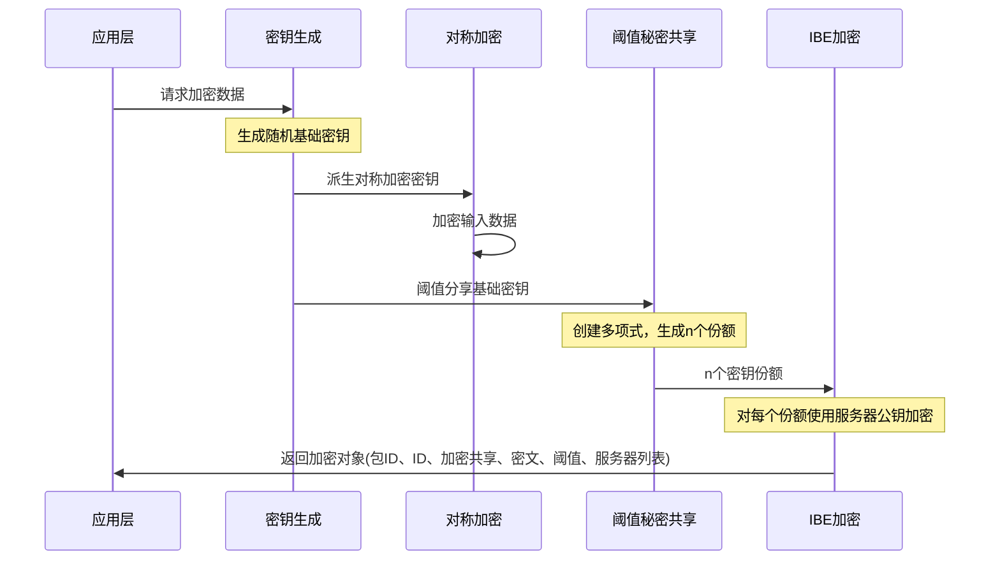
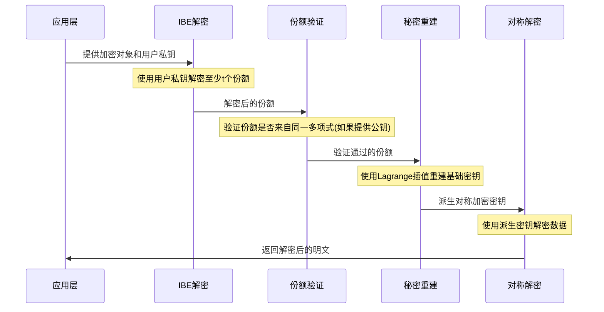

# Seal 密钥管理系统 - 密码学核心

本模块实现了 Seal 密钥管理系统的密码学核心组件，提供了安全可靠的密钥管理和加密操作功能。

## 模块结构

Seal 密码学核心由以下主要组件组成：

### 1. 身份基础加密 (IBE)

位于 `ibe.rs` 文件中，实现了 Boneh-Franklin IBE 方案，基于 BLS12-381 椭圆曲线。IBE 允许使用用户身份（如电子邮件地址）作为公钥进行加密，避免了传统公钥基础设施的复杂性。

主要特点：
- 使用任意字符串作为公钥
- 支持批量加密和确定性加密
- 提供密钥持有证明机制
- 使用双线性配对进行加密操作

### 2. 阈值密钥共享 (TSS)

位于 `tss.rs` 文件中，实现了 Shamir 秘密共享方案，允许将秘密分割成多个份额，需要一定数量的份额才能重建秘密。

主要特点：
- 支持任意阈值设置
- 可处理任意 32 字节秘密
- 使用有限域运算保证安全性
- 提供份额验证机制

### 3. 有限域数学 (GF256)

位于 `gf256.rs` 文件中，提供了 GF(256) 有限域的高效实现，支持基本的数学运算。

主要特点：
- 使用查表优化的乘法和除法
- 支持加法、减法、乘法、除法等基本运算
- 为多项式插值提供基础
- 实现了域元素的序列化和反序列化

### 4. 多项式计算

位于 `polynomial.rs` 文件中，实现了 GF(256) 上的多项式表示和操作，用于支持秘密共享和密钥恢复。

主要特点：
- 多项式求值
- Lagrange 插值
- 多项式加法和乘法
- 高效的多项式系数计算

### 5. 数据加密机制 (DEM)

位于 `dem.rs` 文件中，提供了两种对称加密算法实现：
- AES-256-GCM：标准的认证加密算法，提供强大的保密性和完整性保护
- HMAC-256-CTR：基于 HMAC-SHA3-256 的自定义认证加密，结合CTR模式和MAC认证

### 6. ElGamal 加密

位于 `elgamal.rs` 文件中，实现了基于椭圆曲线的 ElGamal 加密算法，用于安全通信。

### 7. 工具函数

位于 `utils.rs` 文件中，提供了各种辅助函数，包括：
- 随机字节生成
- 字节数组运算（XOR等）
- 矩阵转置操作
- 数据格式转换

## 功能流程图

### 加密流程 (seal_encrypt)



### 解密流程 (seal_decrypt)



## 模块内部实现详情

### 身份基础加密 (IBE) 实现

IBE 是一种先进的公钥加密系统，其中任何字符串（如电子邮件地址）都可以作为公钥使用。在我们的实现中：

1. **主密钥生成**：密钥服务器生成主私钥和对应的主公钥
2. **用户密钥提取**：从主私钥和用户身份生成用户私钥
3. **加密**：使用用户身份和主公钥加密消息
4. **解密**：使用用户私钥解密消息

IBE加密流程详图：
```mermaid
flowchart LR
    A[生成随机值r] --> B[计算身份哈希H(ID)]
    B --> C[执行双线性配对e(H(ID), PK^r)]
    C --> D[计算加密结果m⊕KDF(e)]
    D --> E[返回密文和随机数]
```

### 阈值秘密共享 (TSS) 实现

阈值秘密共享允许将秘密分成n份，需要至少t份才能重建，其中t ≤ n。实现基于Shamir的秘密共享方案：

1. **分享生成**：
   - 创建一个t-1次随机多项式，常数项为秘密值
   - 计算n个不同点上的多项式值，作为n个份额

2. **秘密重建**：
   - 收集至少t个有效份额
   - 使用拉格朗日插值计算多项式的常数项（即原始秘密）

TSS处理流程：
```mermaid
flowchart TD
    subgraph 分享过程
    A[构造随机多项式<br>f(x)=s+a₁x+a₂x²+...+aₜ₋₁xᵗ⁻¹] --> B[在n个点计算值<br>f(1), f(2), ..., f(n)]
    B --> C[分发共享给各<br>密钥服务器]
    end
    
    subgraph 重建过程
    D[收集至少t个共享] --> E[拉格朗日插值<br>计算f(0)]
    E --> F[获得多项式的<br>常数项(秘密)]
    end
```

### 数据加密机制 (DEM) 实现

DEM提供了两种加密模式的实现：

1. **AES-256-GCM**:
   - 标准的认证加密算法
   - 提供了机密性、完整性和真实性保证
   - 使用随机IV和额外认证数据(AAD)
   - 支持完整性验证，防止数据篡改

2. **HMAC-256-CTR**:
   - 使用CTR模式的流加密结合HMAC-SHA3-256
   - 适用于需要更灵活控制的场景
   - 支持额外认证数据(AAD)
   - 派生两个密钥：一个用于加密，一个用于MAC

```mermaid
flowchart LR
    subgraph AES-GCM
    A1[输入消息和AAD] --> B1[使用AES-256-GCM<br>加密消息]
    B1 --> C1[生成认证标签]
    C1 --> D1[返回密文和标签]
    end
    
    subgraph HMAC-CTR
    A2[输入消息和AAD] --> B2[派生加密密钥<br>k₁=HMAC(key,1)]
    B2 --> C2[CTR模式加密<br>c=m⊕HMAC(k₁,i)]
    A2 --> D2[派生MAC密钥<br>k₂=HMAC(key,2)]
    C2 --> E2[计算MAC<br>mac=HMAC(k₂,AAD||c)]
    D2 --> E2
    E2 --> F2[返回密文和MAC]
    end
```

### 集成流程

当一个应用需要加密数据时，整个系统的工作流程如下：

1. 应用调用`seal_encrypt`函数：
   - 生成随机基础密钥
   - 派生对称加密密钥
   - 使用对称密钥和选定的DEM算法加密数据
   - 使用TSS将基础密钥分成多个共享
   - 使用IBE和各密钥服务器的公钥加密这些共享
   - 返回加密对象

2. 解密时，应用调用`seal_decrypt`函数：
   - 使用用户IBE私钥解密所需数量的共享
   - 通过TSS重建基础密钥
   - 派生对称密钥
   - 使用对称密钥和相应的DEM算法解密数据
   - 返回解密后的明文

## 安全特性

- **阈值安全**：即使部分密钥服务器被攻破，也需要达到阈值数量才能访问加密数据
- **前向安全**：如果基础密钥泄露，历史加密数据仍然安全（通过密钥派生机制）
- **密钥共享一致性验证**：可以验证所有共享是否来自同一多项式，防止篡改
- **多模式支持**：支持不同安全级别和性能需求的加密模式
- **身份绑定**：密钥与特定身份绑定，减少密钥管理复杂性
- **抗量子攻击考虑**：使用足够安全强度的密码学原语

## 性能优化

- **查表实现有限域运算**：GF(256)域上的乘除法使用预计算表加速
- **高效多项式插值**：优化的Lagrange插值算法
- **批量加密**：支持一次性处理多个密文
- **内存优化**：避免不必要的内存分配和拷贝

## 使用场景

此密码学核心设计用于：
- 敏感数据的安全存储
- 分布式密钥管理系统
- 需要去中心化控制的数据访问系统
- 安全的多方计算系统
- 防止单点故障的高可用密钥恢复机制
- 基于属性的访问控制系统
- 安全的企业文档共享和协作环境 