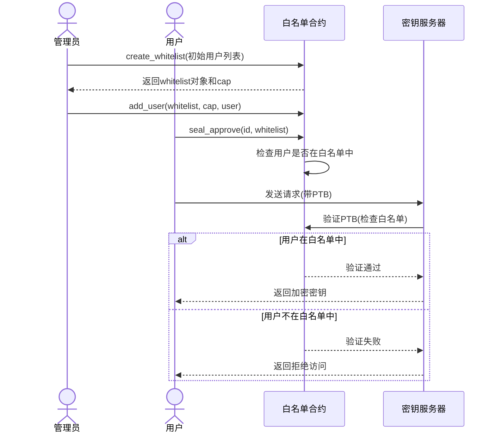
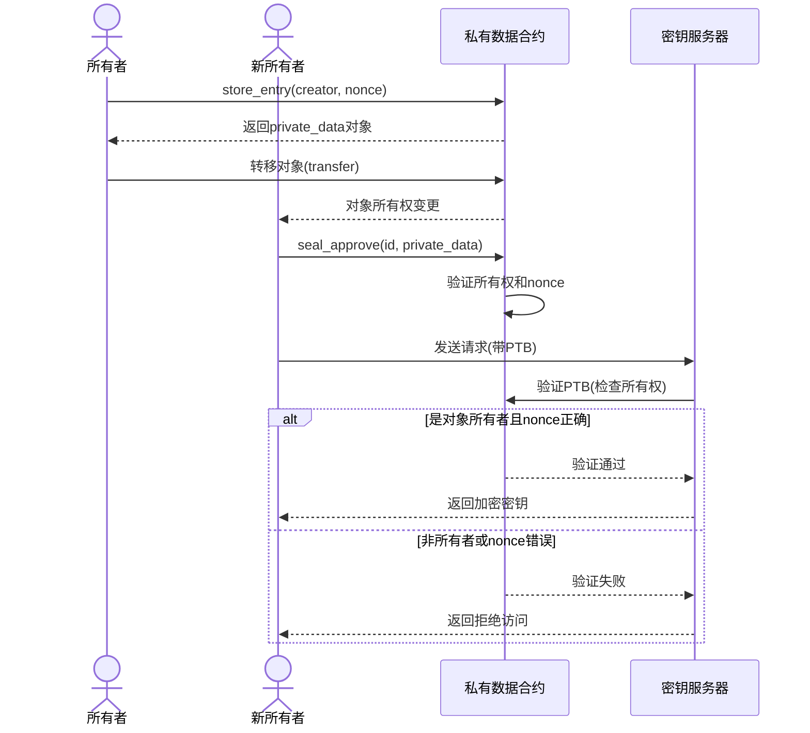
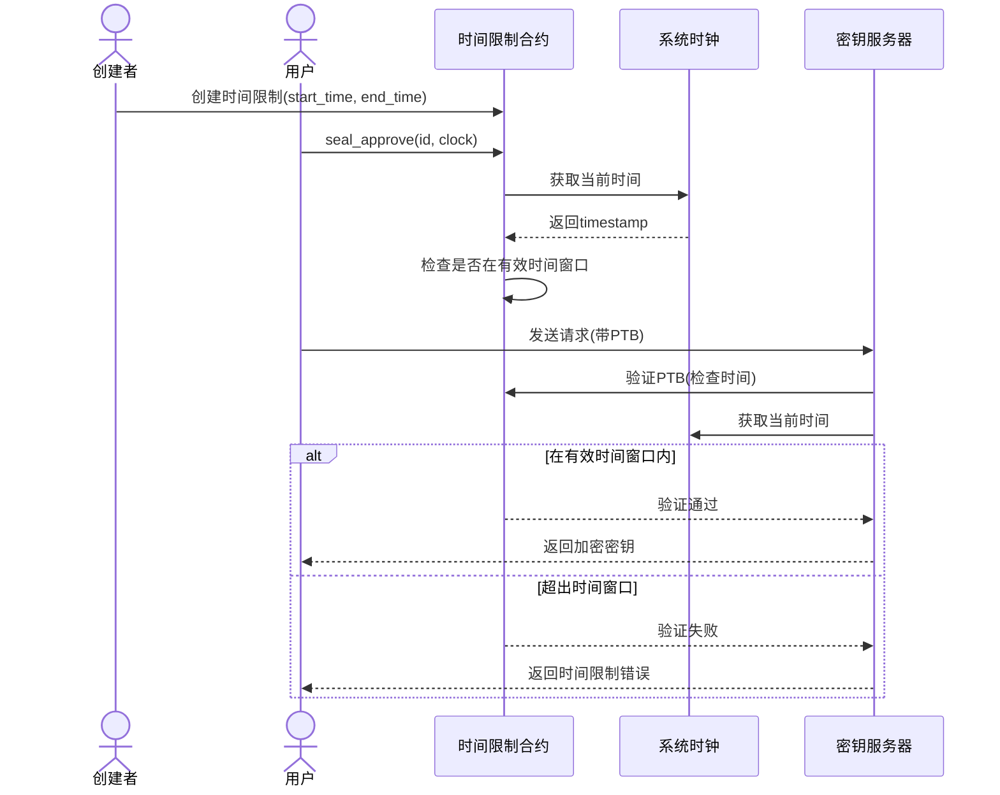
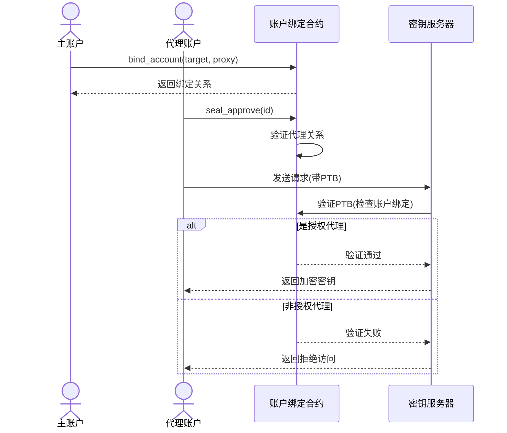
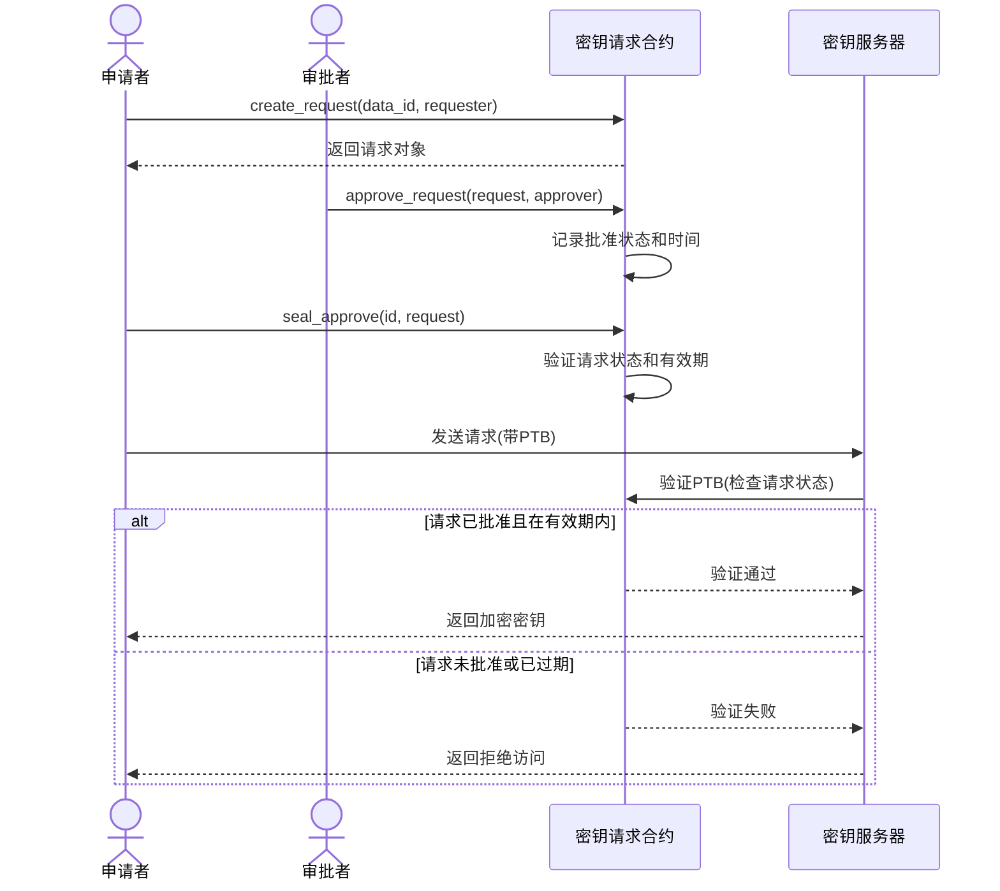
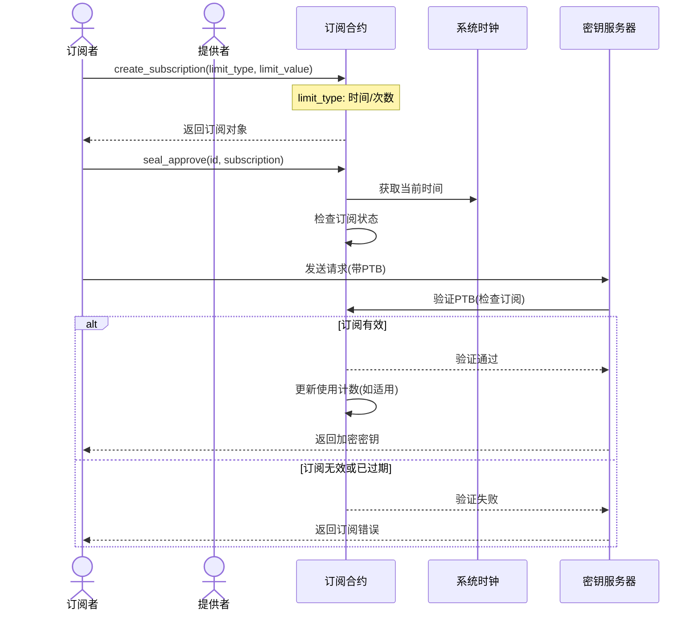
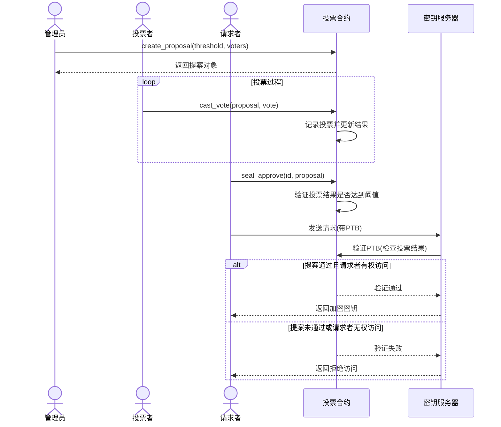
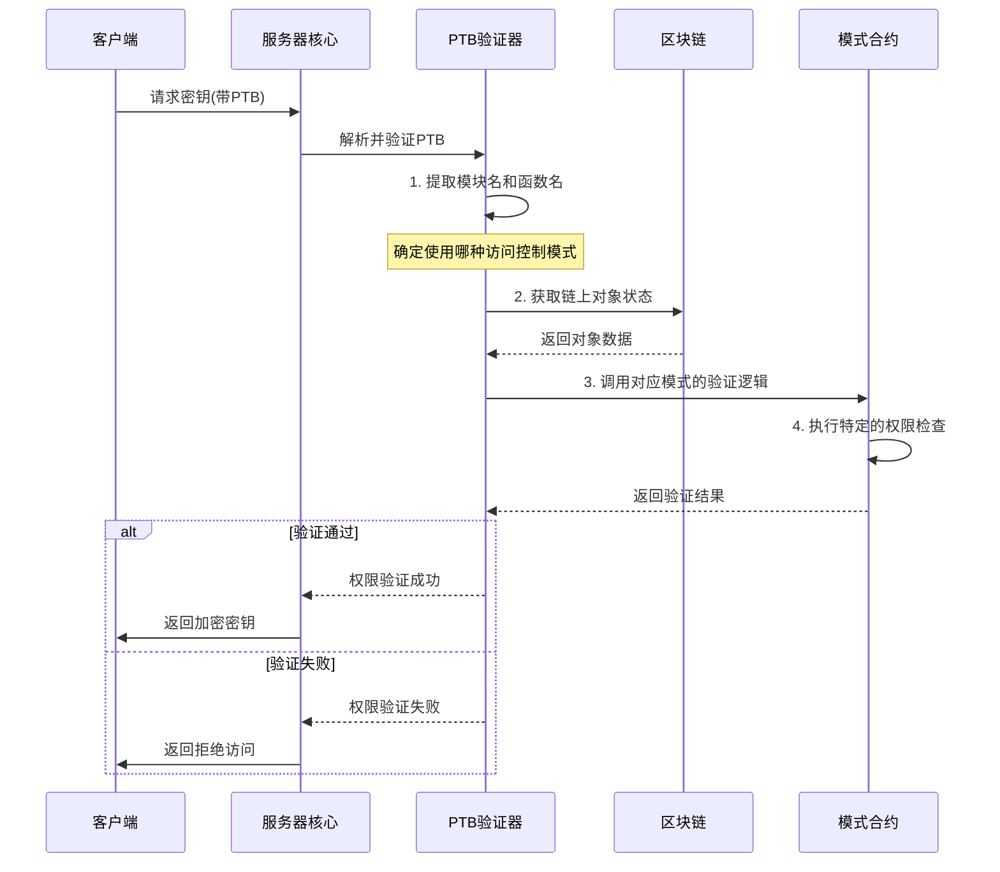
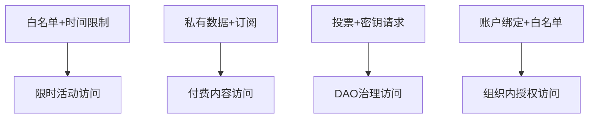
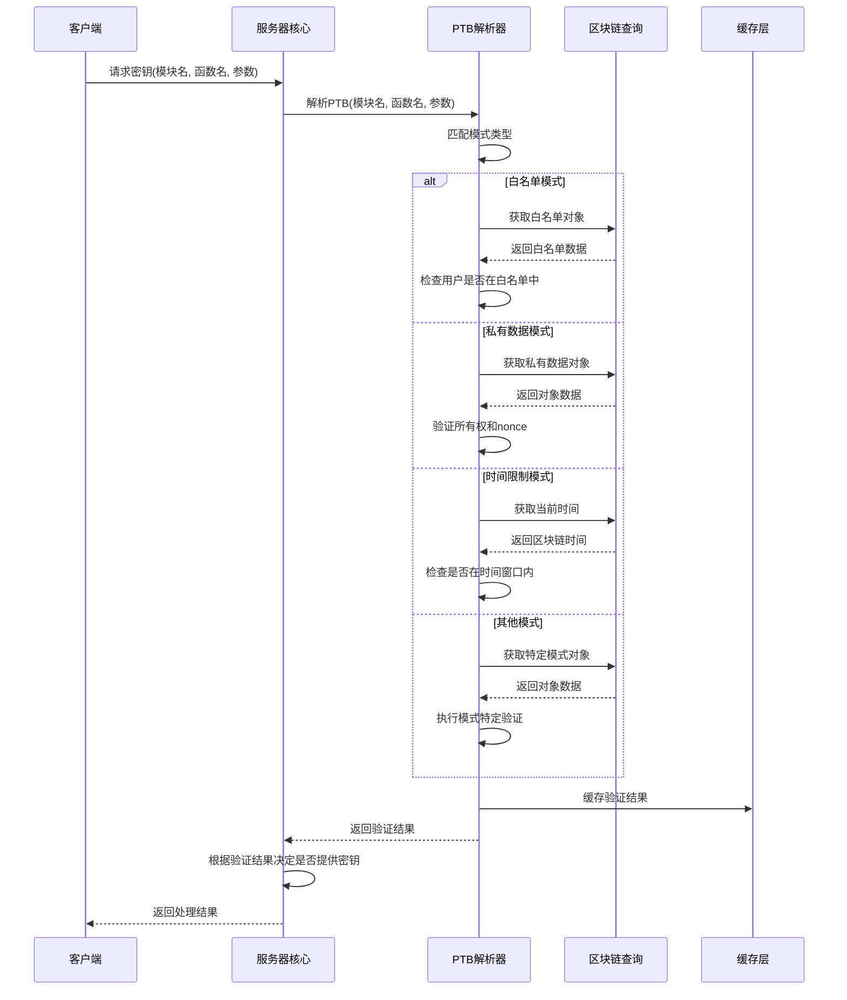

# Seal 应用模式集合

> 部署地址: patterns:0x9ac6b3046eb7e0a3c3884dd691117461579f332b9eb78e496b97fab344dffc51

## 1. 模块概述

Seal应用模式集合提供了一系列灵活、可组合的访问控制模式，基于密钥管理系统实现不同场景下的加密授权机制。这些模式与链下密钥服务器协同工作，实现链上访问控制策略与链下密钥派生的完美结合。

## 2. 架构设计

应用模式基于以下核心架构：

```mermaid
flowchart TD
    subgraph 链上模式集合[Patterns]
        WL[白名单模式]
        PD[私有数据模式]
        TLE[时间限制模式]
        AB[账户绑定模式]
        KR[密钥请求模式]
        SUB[订阅模式]
        VOTE[投票模式]
    end
    
    subgraph 链下组件[密钥服务器]
        Server[服务器核心]
        Validator[PTB验证器]
        IBE[密钥派生]
    end
    
    subgraph 核心合约[Seal核心]
        KeyRegistry[密钥注册表]
    end
    
    Client[客户端应用] --> 链上模式集合
    链上模式集合 --> 核心合约: 使用密钥服务器
    Client --> 链下组件: 请求密钥
    链下组件 --> 链上模式集合: 验证权限
```

## 3. 主要访问控制模式

### 3.1 白名单模式 (Whitelist)

**核心功能**: 基于预定义的地址列表控制资源访问权限。

#### 工作流程



**链下服务器交互**: 服务器从PTB中提取白名单ID和用户地址，在链上验证用户是否在白名单中，只有白名单中的用户能获取密钥。

**实现细节**:
- 支持动态管理白名单成员
- 分层管理权限（超级管理员/普通管理员）
- 包升级强制验证，确保使用最新版本

### 3.2 私有数据模式 (Private Data)

**核心功能**: 将加密数据存储在链上，仅允许数据所有者解密。

#### 工作流程



**链下服务器交互**: 服务器验证请求者是否为私有数据对象的当前所有者，并验证nonce是否匹配，确保密钥ID的唯一性和安全性。

**实现细节**:
- 使用创建者地址和随机nonce构建唯一密钥ID
- 对象所有权转移后，新所有者自动获得解密权限
- 防止抢先攻击和重放攻击

### 3.3 时间限制执行模式 (TLE)

**核心功能**: 创建只在特定时间窗口内可访问的加密资源。

#### 工作流程



**链下服务器交互**: 服务器检查当前时间是否在TLE对象指定的有效时间窗口内，同时验证本地时间与链上时间差异是否在容许范围内。

**实现细节**:
- 使用链上时钟对象获取可信时间
- 支持指定开始时间和结束时间
- 防止时间操纵攻击

### 3.4 账户绑定模式 (Account Based)

**核心功能**: 将加密资源绑定到特定账户，实现授权代理访问。

#### 工作流程



**链下服务器交互**: 服务器验证请求者是否为目标账户的授权代理，检查链上绑定关系是否有效。

**实现细节**:
- 支持多对多的账户绑定关系
- 可动态添加和撤销授权
- 适用于钱包多签和账户委托场景

### 3.5 密钥请求模式 (Key Request)

**核心功能**: 基于链上请求对象实现复杂的访问审批流程。

#### 工作流程



**链下服务器交互**: 服务器检查链上请求对象的状态，验证是否已获批准、是否在有效期内，以及请求者身份是否匹配。

**实现细节**:
- 支持多级审批流程
- 请求对象包含详细的元数据
- 可设置请求有效期限
- 支持批准撤销和重新申请

### 3.6 订阅模式 (Subscription)

**核心功能**: 实现基于时间或使用次数的付费订阅机制。

#### 工作流程



**链下服务器交互**: 服务器验证订阅是否处于活跃状态、是否已支付以及是否在有效期内，对于基于计数的订阅还会检查剩余使用次数。

**实现细节**:
- 支持基于时间和基于计数的限制
- 实现订阅续期和升级机制
- 支持转让订阅权限
- 与支付机制集成

### 3.7 投票模式 (Voting)

**核心功能**: 通过去中心化投票决定资源访问权限。

#### 工作流程



**链下服务器交互**: 服务器检查投票提案的状态，验证是否达到通过所需的票数阈值，以及请求者是否有权访问。

**实现细节**:
- 支持不同的投票权重
- 可设置最低通过阈值
- 投票结果链上透明可验证
- 支持投票期限设置

## 4. 链下服务器验证流程

下图展示了链下服务器如何验证不同模式的访问控制权限：



## 5. 模式组合与高级应用

应用模式的一个强大特性是可以组合使用，创建更复杂的访问控制策略：

### 5.1 模式组合示例



### 5.2 实际应用场景

1. **加密内容市场**
   - 使用订阅模式实现付费访问
   - 私有数据模式保护内容所有权
   - 结合时间限制实现限时优惠

2. **去中心化访问控制**
   - 白名单模式管理组织成员
   - 投票模式实现集体决策
   - 密钥请求模式创建审批流程

3. **数据共享平台**
   - 账户绑定实现安全委托
   - 私有数据模式保护数据隐私
   - 时间限制控制访问有效期

## 6. 链下服务器处理详细流程

每种模式的PTB验证逻辑都由链下服务器的验证器模块处理。下面是核心验证流程：



## 7. 性能与安全考量

### 7.1 性能优化

应用模式设计考虑了链上计算成本和链下验证效率：

1. **链上优化**
   - 最小化存储开销
   - 优化Gas使用
   - 批处理操作支持

2. **链下验证优化**
   - 缓存常用对象查询
   - 异步处理验证请求
   - 并行处理多模式验证

### 7.2 安全机制

模式实现包含多层安全保障：

1. **访问控制一致性**
   - 链上链下验证逻辑一致
   - 包版本强制检查

2. **防攻击机制**
   - 防重放保护
   - 权限分离
   - 时间戳验证

3. **容错设计**
   - 处理边界条件
   - 优雅降级策略
   - 异常处理机制

## 8. 开发与集成

### 8.1 开发新模式

开发者可以基于现有模式创建新的访问控制模式：

```move
module example::new_pattern {
    // 导入基础库
    use sui::object::{Self, UID};
    use sui::tx_context::{Self, TxContext};
    
    // 定义模式特定对象
    struct MyPattern has key, store {
        id: UID,
        // 模式特定字段
    }
    
    // 创建对象函数
    public fun create(...) { ... }
    
    // 权限验证函数 - 与Seal集成的关键
    public fun seal_approve(id: vector<u8>, pattern: &MyPattern) { ... }
    
    // 模式特定逻辑
    // ...
}
```

### 8.2 与链下服务器集成

新模式需要在链下服务器的验证器中添加支持：

1. 在PTB解析器中添加模式识别
2. 实现特定模式的验证逻辑
3. 处理模式特定的错误和异常

## 9. 未来发展方向

1. **更多应用模式**
   - 基于ZK证明的访问控制
   - 多因素认证模式
   - 声誉系统集成

2. **跨链互操作**
   - 支持多链验证
   - 跨链身份集成
   - 统一访问控制标准

3. **高级密码学特性**
   - 可验证延迟函数
   - 前向安全密钥更新
   - 属性基础加密支持 