# Seal 密钥服务器测试框架

本文档描述了 Seal 密钥服务器系统的测试框架结构、测试用例类型和实现方式。测试框架旨在验证密钥服务器的各种功能和安全特性，确保系统在不同场景下正确运行。

## 测试框架概述

测试框架基于 `SealTestCluster` 结构体，它是对 Sui 测试集群的封装，添加了 Seal 密钥服务器特定的功能。框架实现了以下核心功能：

- 创建和管理测试集群、密钥服务器和测试用户
- 部署和升级智能合约
- 在链上注册密钥服务器
- 获取和验证密钥服务器公钥
- 构建和执行各种访问控制测试

## 测试用例类型

测试框架覆盖了以下主要类型的测试用例：

### 1. 端到端 (E2E) 测试

端到端测试验证了从密钥服务器注册、用户请求密钥、加密到解密的完整流程。这是最全面的测试，确保系统所有组件能够协同工作。

**测试内容**：
- 创建测试集群并发布必要的智能合约
- 创建和配置白名单
- 从多个密钥服务器获取用户密钥
- 在链上注册密钥服务器
- 使用 Seal 系统加密和解密消息

**实现文件**：`e2e.rs`

**端到端测试流程图**：

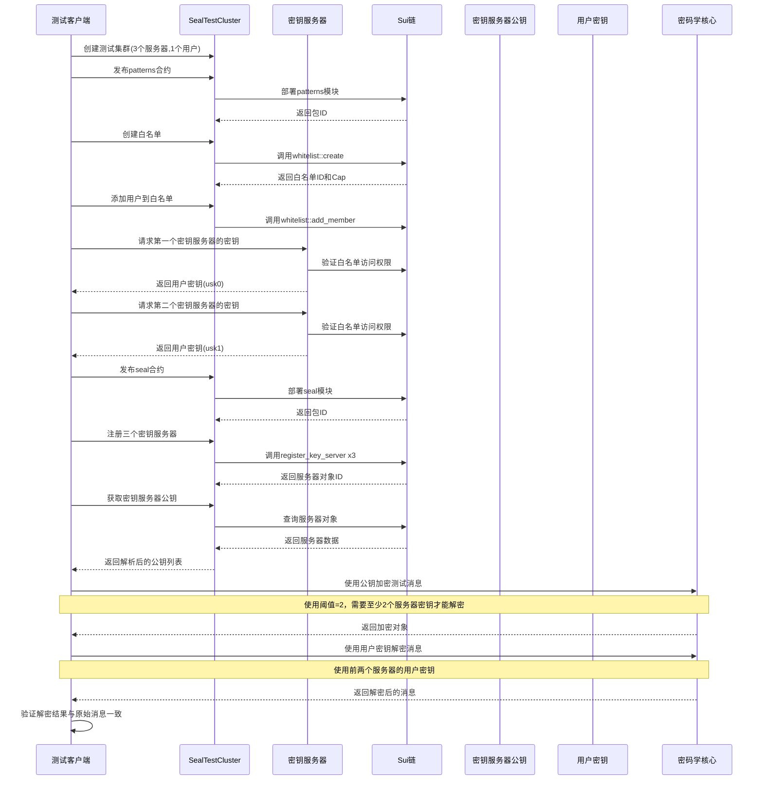
```mermaid
sequenceDiagram
    participant TC as 测试客户端
    participant Cluster as SealTestCluster
    participant KS as 密钥服务器
    participant Chain as Sui链
    participant PKs as 密钥服务器公钥
    participant USKs as 用户密钥
    participant Crypto as 密码学核心
    
    TC->>Cluster: 创建测试集群(3个服务器,1个用户)
    TC->>Cluster: 发布patterns合约
    Cluster->>Chain: 部署patterns模块
    Chain-->>Cluster: 返回包ID
    
    TC->>Cluster: 创建白名单
    Cluster->>Chain: 调用whitelist::create
    Chain-->>Cluster: 返回白名单ID和Cap
    
    TC->>Cluster: 添加用户到白名单
    Cluster->>Chain: 调用whitelist::add_member
    
    TC->>KS: 请求第一个密钥服务器的密钥
    KS->>Chain: 验证白名单访问权限
    KS-->>TC: 返回用户密钥(usk0)
    
    TC->>KS: 请求第二个密钥服务器的密钥
    KS->>Chain: 验证白名单访问权限
    KS-->>TC: 返回用户密钥(usk1)
    
    TC->>Cluster: 发布seal合约
    Cluster->>Chain: 部署seal模块
    Chain-->>Cluster: 返回包ID
    
    TC->>Cluster: 注册三个密钥服务器
    Cluster->>Chain: 调用register_key_server x3
    Chain-->>Cluster: 返回服务器对象ID
    
    TC->>Cluster: 获取密钥服务器公钥
    Cluster->>Chain: 查询服务器对象
    Chain-->>Cluster: 返回服务器数据
    Cluster-->>TC: 返回解析后的公钥列表
    
    TC->>Crypto: 使用公钥加密测试消息
    Note over TC,Crypto: 使用阈值=2，需要至少2个服务器密钥才能解密
    Crypto-->>TC: 返回加密对象
    
    TC->>Crypto: 使用用户密钥解密消息
    Note over TC,Crypto: 使用前两个服务器的用户密钥
    Crypto-->>TC: 返回解密后的消息
    
    TC->>TC: 验证解密结果与原始消息一致
```

### 2. 访问控制模式测试

测试框架实现了多种不同的访问控制模式测试，每种都验证特定的权限管理机制。Seal 系统支持七种主要的访问控制模式，但当前测试框架主要聚焦于其中的三种模式的具体测试实现，其余模式在 Move 合约中有详细实现和单元测试：

#### a. 白名单 (Whitelist) 访问控制

**测试内容**：
- 创建白名单并添加用户
- 验证白名单中的用户可以获取密钥
- 验证不在白名单中的用户无法获取密钥
- 测试包升级后的白名单行为，确保系统强制使用最新版本

**实现文件**：`whitelist.rs`

**白名单测试流程图**：

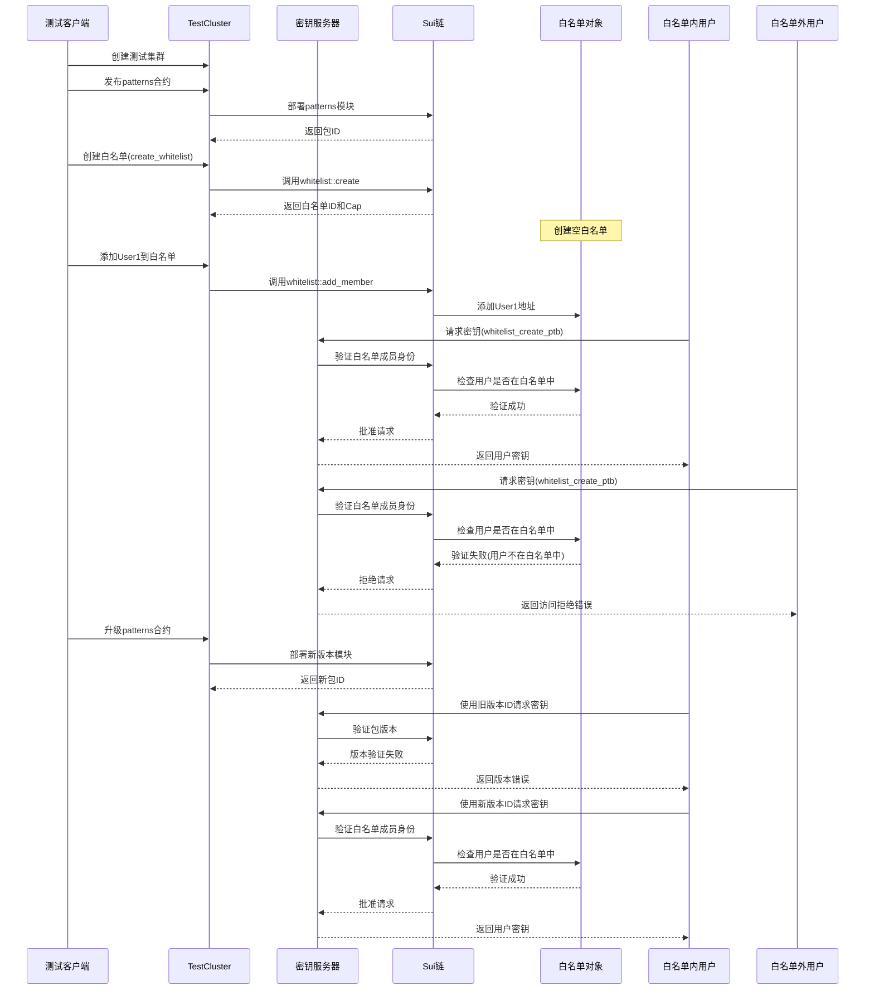
```mermaid
sequenceDiagram
    participant TC as 测试客户端
    participant Cluster as TestCluster
    participant KS as 密钥服务器
    participant Chain as Sui链
    participant Whitelist as 白名单对象
    participant User1 as 白名单内用户
    participant User2 as 白名单外用户
    
    TC->>Cluster: 创建测试集群
    TC->>Cluster: 发布patterns合约
    Cluster->>Chain: 部署patterns模块
    Chain-->>Cluster: 返回包ID
    
    TC->>Cluster: 创建白名单(create_whitelist)
    Cluster->>Chain: 调用whitelist::create
    Chain-->>Cluster: 返回白名单ID和Cap
    Note over Whitelist: 创建空白名单
    
    TC->>Cluster: 添加User1到白名单
    Cluster->>Chain: 调用whitelist::add_member
    Chain->>Whitelist: 添加User1地址
    
    User1->>KS: 请求密钥(whitelist_create_ptb)
    KS->>Chain: 验证白名单成员身份
    Chain->>Whitelist: 检查用户是否在白名单中
    Whitelist-->>Chain: 验证成功
    Chain-->>KS: 批准请求
    KS-->>User1: 返回用户密钥
    
    User2->>KS: 请求密钥(whitelist_create_ptb)
    KS->>Chain: 验证白名单成员身份
    Chain->>Whitelist: 检查用户是否在白名单中
    Whitelist-->>Chain: 验证失败(用户不在白名单中)
    Chain-->>KS: 拒绝请求
    KS-->>User2: 返回访问拒绝错误
    
    TC->>Cluster: 升级patterns合约
    Cluster->>Chain: 部署新版本模块
    Chain-->>Cluster: 返回新包ID
    
    User1->>KS: 使用旧版本ID请求密钥
    KS->>Chain: 验证包版本
    Chain-->>KS: 版本验证失败
    KS-->>User1: 返回版本错误
    
    User1->>KS: 使用新版本ID请求密钥
    KS->>Chain: 验证白名单成员身份
    Chain->>Whitelist: 检查用户是否在白名单中
    Whitelist-->>Chain: 验证成功
    Chain-->>KS: 批准请求
    KS-->>User1: 返回用户密钥
```

#### b. 私有数据 (PrivateData) 访问控制

**测试内容**：
- 创建私有数据对象并转移给特定用户
- 验证数据所有者可以访问自己的私有数据
- 验证非所有者不能访问私有数据
- 测试使用错误的 nonce 不能访问私有数据

**实现文件**：`pd.rs`

**私有数据测试流程图**：

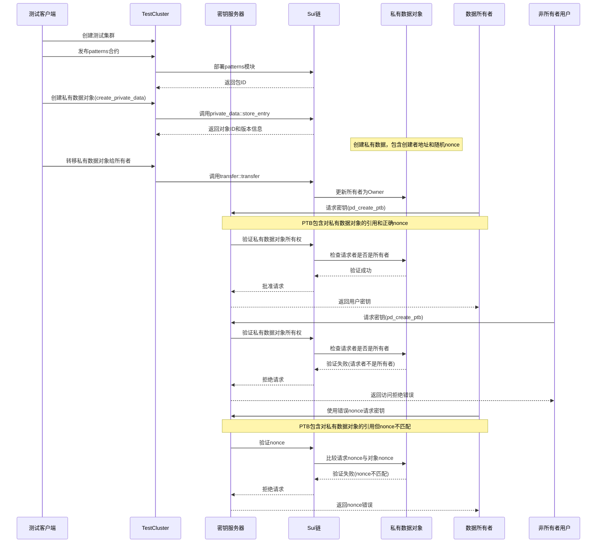
```mermaid
sequenceDiagram
    participant TC as 测试客户端
    participant Cluster as TestCluster
    participant KS as 密钥服务器
    participant Chain as Sui链
    participant PD as 私有数据对象
    participant Owner as 数据所有者
    participant NonOwner as 非所有者用户
    
    TC->>Cluster: 创建测试集群
    TC->>Cluster: 发布patterns合约
    Cluster->>Chain: 部署patterns模块
    Chain-->>Cluster: 返回包ID
    
    TC->>Cluster: 创建私有数据对象(create_private_data)
    Cluster->>Chain: 调用private_data::store_entry
    Chain-->>Cluster: 返回对象ID和版本信息
    Note over PD: 创建私有数据，包含创建者地址和随机nonce
    
    TC->>Cluster: 转移私有数据对象给所有者
    Cluster->>Chain: 调用transfer::transfer
    Chain->>PD: 更新所有者为Owner
    
    Owner->>KS: 请求密钥(pd_create_ptb)
    Note over Owner,KS: PTB包含对私有数据对象的引用和正确nonce
    KS->>Chain: 验证私有数据对象所有权
    Chain->>PD: 检查请求者是否是所有者
    PD-->>Chain: 验证成功
    Chain-->>KS: 批准请求
    KS-->>Owner: 返回用户密钥
    
    NonOwner->>KS: 请求密钥(pd_create_ptb)
    KS->>Chain: 验证私有数据对象所有权
    Chain->>PD: 检查请求者是否是所有者
    PD-->>Chain: 验证失败(请求者不是所有者)
    Chain-->>KS: 拒绝请求
    KS-->>NonOwner: 返回访问拒绝错误
    
    Owner->>KS: 使用错误nonce请求密钥
    Note over Owner,KS: PTB包含对私有数据对象的引用但nonce不匹配
    KS->>Chain: 验证nonce
    Chain->>PD: 比较请求nonce与对象nonce
    PD-->>Chain: 验证失败(nonce不匹配)
    Chain-->>KS: 拒绝请求
    KS-->>Owner: 返回nonce错误
```

#### c. 时间限制执行 (TLE) 访问控制

**测试内容**：
- 验证过去或当前时间的执行请求被批准
- 验证未来时间的执行请求被拒绝
- 测试各种证书验证机制
- 验证请求签名的正确性

**实现文件**：`tle.rs`

**时间限制执行测试流程图**：

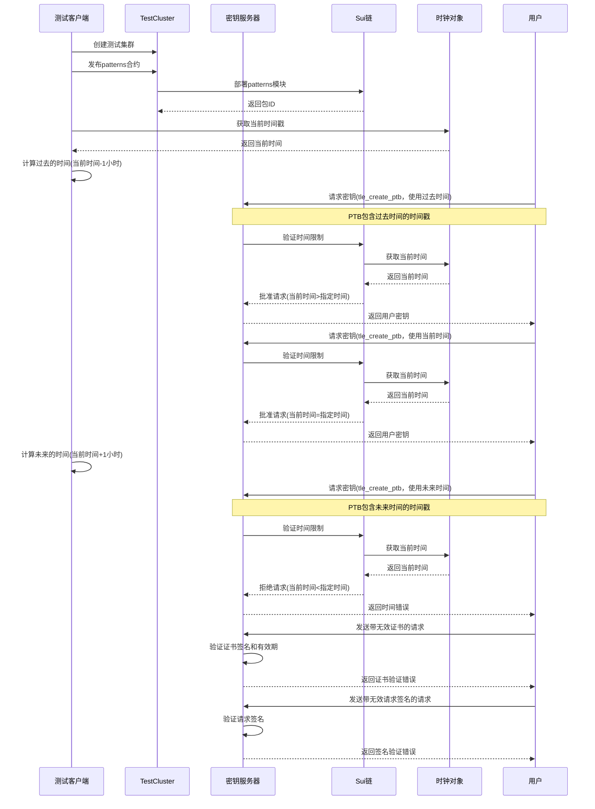
```mermaid
sequenceDiagram
    participant TC as 测试客户端
    participant Cluster as TestCluster
    participant KS as 密钥服务器
    participant Chain as Sui链
    participant Clock as 时钟对象
    participant User as 用户
    
    TC->>Cluster: 创建测试集群
    TC->>Cluster: 发布patterns合约
    Cluster->>Chain: 部署patterns模块
    Chain-->>Cluster: 返回包ID
    
    TC->>Clock: 获取当前时间戳
    Clock-->>TC: 返回当前时间
    
    TC->>TC: 计算过去的时间(当前时间-1小时)
    
    User->>KS: 请求密钥(tle_create_ptb，使用过去时间)
    Note over User,KS: PTB包含过去时间的时间戳
    KS->>Chain: 验证时间限制
    Chain->>Clock: 获取当前时间
    Clock-->>Chain: 返回当前时间
    Chain-->>KS: 批准请求(当前时间>指定时间)
    KS-->>User: 返回用户密钥
    
    User->>KS: 请求密钥(tle_create_ptb，使用当前时间)
    KS->>Chain: 验证时间限制
    Chain->>Clock: 获取当前时间
    Clock-->>Chain: 返回当前时间
    Chain-->>KS: 批准请求(当前时间=指定时间)
    KS-->>User: 返回用户密钥
    
    TC->>TC: 计算未来的时间(当前时间+1小时)
    
    User->>KS: 请求密钥(tle_create_ptb，使用未来时间)
    Note over User,KS: PTB包含未来时间的时间戳
    KS->>Chain: 验证时间限制
    Chain->>Clock: 获取当前时间
    Clock-->>Chain: 返回当前时间
    Chain-->>KS: 拒绝请求(当前时间<指定时间)
    KS-->>User: 返回时间错误
    
    User->>KS: 发送带无效证书的请求
    KS->>KS: 验证证书签名和有效期
    KS-->>User: 返回证书验证错误
    
    User->>KS: 发送带无效请求签名的请求
    KS->>KS: 验证请求签名
    KS-->>User: 返回签名验证错误
```

#### d. 基于账户 (Account-Based) 访问控制

**模式概述**：
- 任何人都可以向特定地址加密内容
- 只有该地址的所有者可以访问关联的密钥
- 密钥ID格式：`[包ID]::[bcs::to_bytes(地址B)]`

**适用场景**：
- 链下安全消息传递
- 点对点加密通信

**实现文件**：在 `move/patterns/sources/account_based.move` 中实现，Move 单元测试验证

**基于账户的访问控制流程图**：

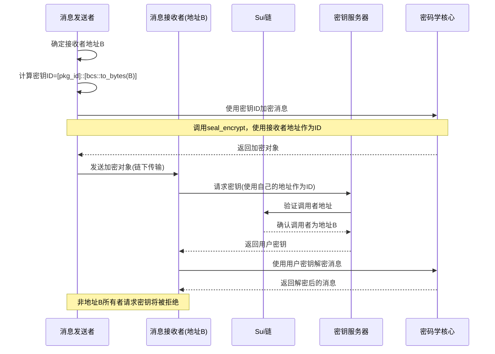
```mermaid
sequenceDiagram
    participant Sender as 消息发送者
    participant Receiver as 消息接收者(地址B)
    participant Chain as Sui链
    participant KS as 密钥服务器
    participant Crypto as 密码学核心
    
    Sender->>Sender: 确定接收者地址B
    Sender->>Sender: 计算密钥ID=[pkg_id]::[bcs::to_bytes(B)]
    
    Sender->>Crypto: 使用密钥ID加密消息
    Note over Sender,Crypto: 调用seal_encrypt，使用接收者地址作为ID
    Crypto-->>Sender: 返回加密对象
    
    Sender->>Receiver: 发送加密对象(链下传输)
    
    Receiver->>KS: 请求密钥(使用自己的地址作为ID)
    KS->>Chain: 验证调用者地址
    Chain-->>KS: 确认调用者为地址B
    KS-->>Receiver: 返回用户密钥
    
    Receiver->>Crypto: 使用用户密钥解密消息
    Crypto-->>Receiver: 返回解密后的消息
    
    Note over Sender,Receiver: 非地址B所有者请求密钥将被拒绝
```

#### e. 密钥请求 (KeyRequest) 访问控制

**模式概述**：
- 政策在链上检查，如授权通过则向用户返回 KeyRequest 对象
- 用户使用 KeyRequest 对象通过 Seal 访问关联密钥
- 支持复杂的访问控制策略，如时间限制、用户身份验证等

**适用场景**：
- 按密钥请求付费系统
- 需要在 dryRun 期间保证安全性的复杂策略

**实现文件**：在 `move/patterns/sources/key_request.move` 中实现，包括与白名单结合的示例

**密钥请求访问控制流程图**：

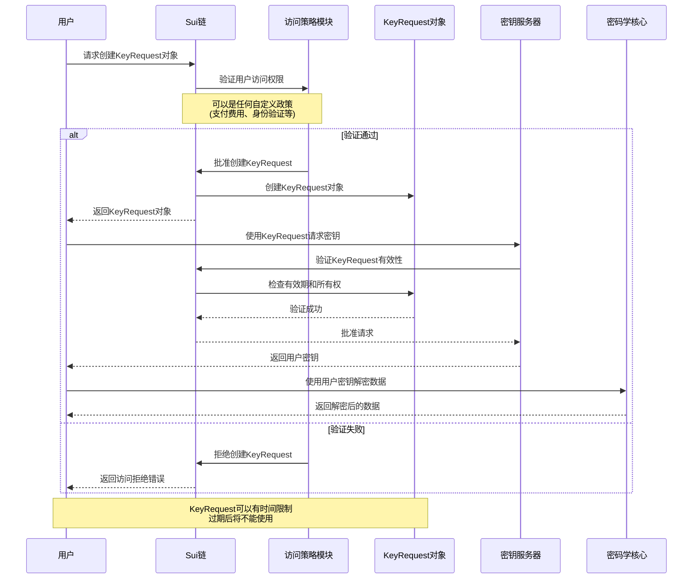
```mermaid
sequenceDiagram
    participant User as 用户
    participant Chain as Sui链
    participant Policy as 访问策略模块
    participant KR as KeyRequest对象
    participant KS as 密钥服务器
    participant Crypto as 密码学核心
    
    User->>Chain: 请求创建KeyRequest对象
    Chain->>Policy: 验证用户访问权限
    Note over Chain,Policy: 可以是任何自定义政策<br>(支付费用、身份验证等)
    
    alt 验证通过
        Policy->>Chain: 批准创建KeyRequest
        Chain->>KR: 创建KeyRequest对象
        Chain-->>User: 返回KeyRequest对象
        
        User->>KS: 使用KeyRequest请求密钥
        KS->>Chain: 验证KeyRequest有效性
        Chain->>KR: 检查有效期和所有权
        KR-->>Chain: 验证成功
        Chain-->>KS: 批准请求
        KS-->>User: 返回用户密钥
        
        User->>Crypto: 使用用户密钥解密数据
        Crypto-->>User: 返回解密后的数据
    else 验证失败
        Policy->>Chain: 拒绝创建KeyRequest
        Chain-->>User: 返回访问拒绝错误
    end
    
    Note over User,KR: KeyRequest可以有时间限制<br>过期后将不能使用
```

#### f. 订阅 (Subscription) 访问控制

**模式概述**：
- 允许创建需要订阅的服务
- 用户可购买一定期限的服务订阅
- 拥有有效订阅的用户可访问服务相关密钥

**适用场景**：
- 基于订阅的内容访问服务
- 会员制加密内容平台

**实现文件**：在 `move/patterns/sources/subscription.move` 中实现，具有完整的时间检查机制

**订阅访问控制流程图**：

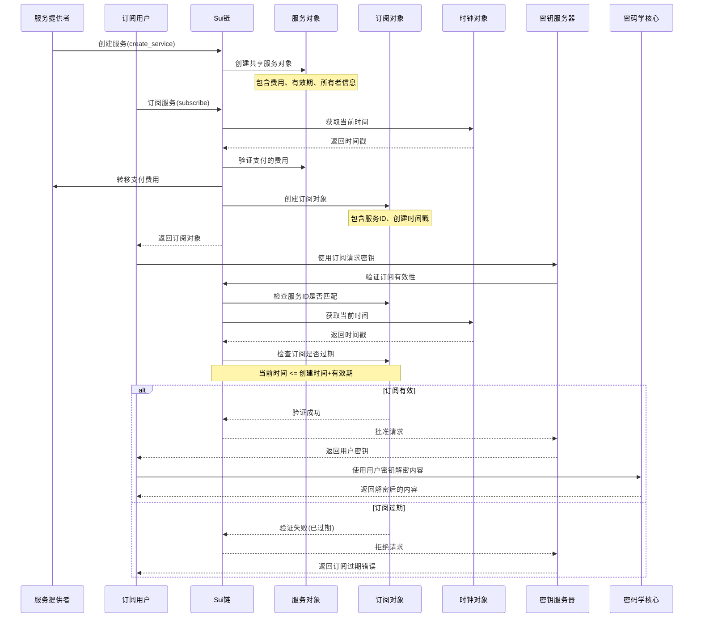
```mermaid
sequenceDiagram
    participant SP as 服务提供者
    participant User as 订阅用户
    participant Chain as Sui链
    participant Service as 服务对象
    participant Sub as 订阅对象
    participant Clock as 时钟对象
    participant KS as 密钥服务器
    participant Crypto as 密码学核心
    
    SP->>Chain: 创建服务(create_service)
    Chain->>Service: 创建共享服务对象
    Note over Service: 包含费用、有效期、所有者信息
    
    User->>Chain: 订阅服务(subscribe)
    Chain->>Clock: 获取当前时间
    Clock-->>Chain: 返回时间戳
    Chain->>Service: 验证支付的费用
    Chain->>SP: 转移支付费用
    Chain->>Sub: 创建订阅对象
    Note over Sub: 包含服务ID、创建时间戳
    Chain-->>User: 返回订阅对象
    
    User->>KS: 使用订阅请求密钥
    KS->>Chain: 验证订阅有效性
    Chain->>Sub: 检查服务ID是否匹配
    Chain->>Clock: 获取当前时间
    Clock-->>Chain: 返回时间戳
    Chain->>Sub: 检查订阅是否过期
    Note over Chain,Sub: 当前时间 <= 创建时间+有效期
    
    alt 订阅有效
        Sub-->>Chain: 验证成功
        Chain-->>KS: 批准请求
        KS-->>User: 返回用户密钥
        
        User->>Crypto: 使用用户密钥解密内容
        Crypto-->>User: 返回解密后的内容
    else 订阅过期
        Sub-->>Chain: 验证失败(已过期)
        Chain-->>KS: 拒绝请求
        KS-->>User: 返回订阅过期错误
    end
```

#### g. 投票 (Voting) 机制

**模式概述**：
- 创建包含一组投票者的投票
- 投票者提交加密投票
- 所有投票者提交后，可检索加密密钥并在链上解密投票

**适用场景**：
- 加密投票系统
- 链上解密应用（如拍卖、时间锁定投票）

**实现文件**：在 `move/patterns/sources/voting.move` 中实现，展示了链上解密的复杂用例

**投票机制流程图**：

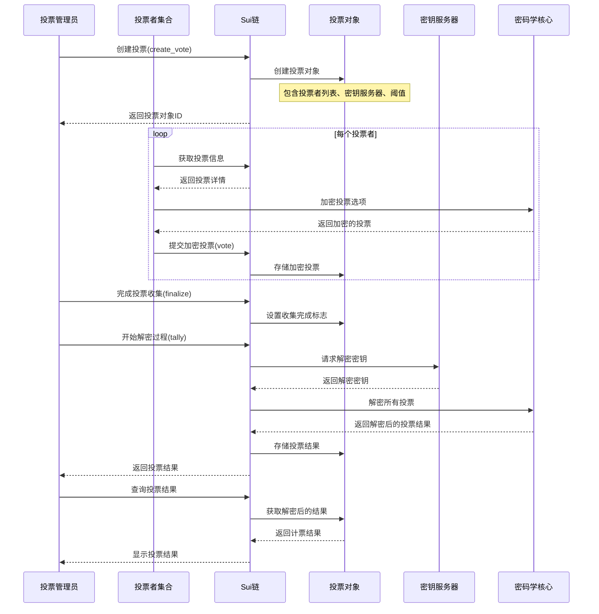
```mermaid
sequenceDiagram
    participant Admin as 投票管理员
    participant Voters as 投票者集合
    participant Chain as Sui链
    participant Vote as 投票对象
    participant KS as 密钥服务器
    participant Crypto as 密码学核心
    
    Admin->>Chain: 创建投票(create_vote)
    Chain->>Vote: 创建投票对象
    Note over Vote: 包含投票者列表、密钥服务器、阈值
    Chain-->>Admin: 返回投票对象ID
    
    loop 每个投票者
        Voters->>Chain: 获取投票信息
        Chain-->>Voters: 返回投票详情
        
        Voters->>Crypto: 加密投票选项
        Crypto-->>Voters: 返回加密的投票
        
        Voters->>Chain: 提交加密投票(vote)
        Chain->>Vote: 存储加密投票
    end
    
    Admin->>Chain: 完成投票收集(finalize)
    Chain->>Vote: 设置收集完成标志
    
    Admin->>Chain: 开始解密过程(tally)
    Chain->>KS: 请求解密密钥
    KS-->>Chain: 返回解密密钥
    
    Chain->>Crypto: 解密所有投票
    Crypto-->>Chain: 返回解密后的投票结果
    
    Chain->>Vote: 存储投票结果
    Chain-->>Admin: 返回投票结果
    
    Admin->>Chain: 查询投票结果
    Chain->>Vote: 获取解密后的结果
    Vote-->>Chain: 返回计票结果
    Chain-->>Admin: 显示投票结果
```

### 3. 服务器后台功能测试

测试服务器的各种后台更新机制，这些机制对于服务器的安全运行至关重要。

**测试内容**：
- 检查点时间戳获取和更新功能
- 参考燃气价格更新功能
- 验证更新间隔和时间戳增长

**实现文件**：`server.rs`

**后台更新机制测试流程图**：

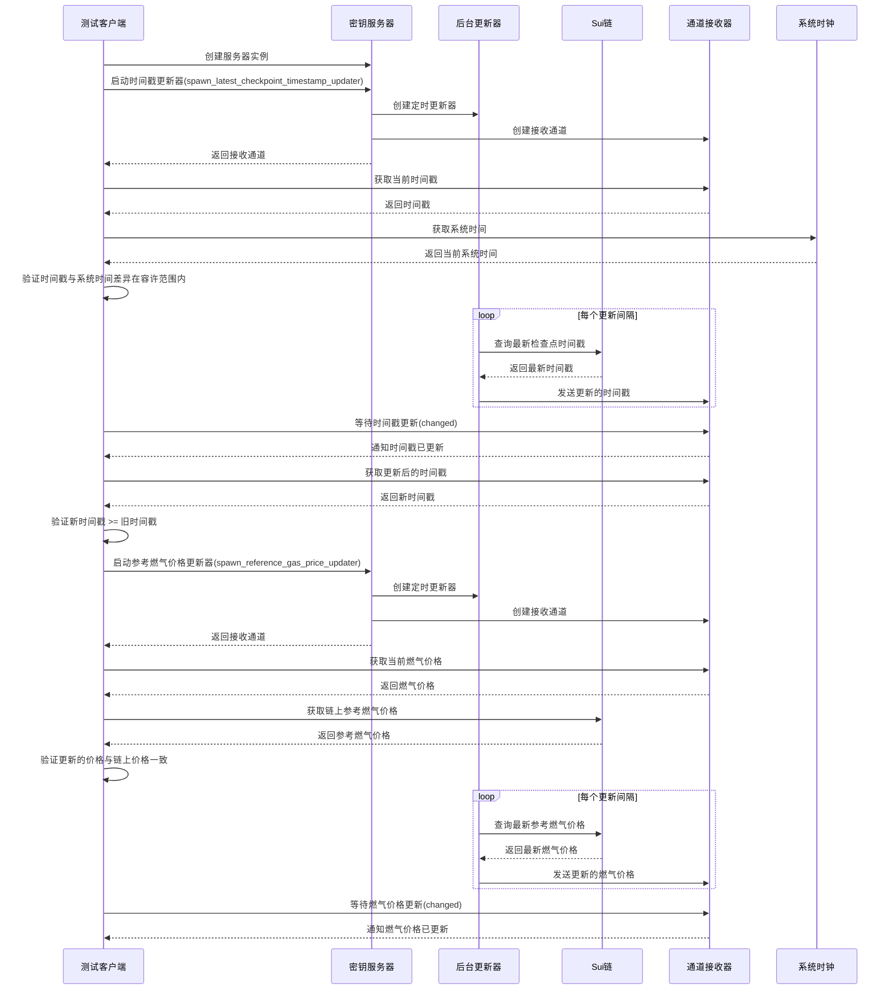
```mermaid
sequenceDiagram
    participant TC as 测试客户端
    participant KS as 密钥服务器
    participant Updater as 后台更新器
    participant Chain as Sui链
    participant Channel as 通道接收器
    participant Clock as 系统时钟
    
    TC->>KS: 创建服务器实例
    
    TC->>KS: 启动时间戳更新器(spawn_latest_checkpoint_timestamp_updater)
    KS->>Updater: 创建定时更新器
    KS->>Channel: 创建接收通道
    KS-->>TC: 返回接收通道
    
    TC->>Channel: 获取当前时间戳
    Channel-->>TC: 返回时间戳
    
    TC->>Clock: 获取系统时间
    Clock-->>TC: 返回当前系统时间
    
    TC->>TC: 验证时间戳与系统时间差异在容许范围内
    
    loop 每个更新间隔
        Updater->>Chain: 查询最新检查点时间戳
        Chain-->>Updater: 返回最新时间戳
        Updater->>Channel: 发送更新的时间戳
    end
    
    TC->>Channel: 等待时间戳更新(changed)
    Channel-->>TC: 通知时间戳已更新
    
    TC->>Channel: 获取更新后的时间戳
    Channel-->>TC: 返回新时间戳
    
    TC->>TC: 验证新时间戳 >= 旧时间戳
    
    TC->>KS: 启动参考燃气价格更新器(spawn_reference_gas_price_updater)
    KS->>Updater: 创建定时更新器
    KS->>Channel: 创建接收通道
    KS-->>TC: 返回接收通道
    
    TC->>Channel: 获取当前燃气价格
    Channel-->>TC: 返回燃气价格
    
    TC->>Chain: 获取链上参考燃气价格
    Chain-->>TC: 返回参考燃气价格
    
    TC->>TC: 验证更新的价格与链上价格一致
    
    loop 每个更新间隔
        Updater->>Chain: 查询最新参考燃气价格
        Chain-->>Updater: 返回最新燃气价格
        Updater->>Channel: 发送更新的燃气价格
    end
    
    TC->>Channel: 等待燃气价格更新(changed)
    Channel-->>TC: 通知燃气价格已更新
```

### 4. 包升级测试

验证系统能够正确处理智能合约的升级，并确保只有最新版本的合约可以被使用。

**测试内容**：
- 发布初始版本的合约
- 升级合约到新版本
- 验证新旧包 ID 不同
- 验证访问控制在升级后的行为

**实现位置**：`mod.rs` 中的 `test_pkg_upgrade` 函数和 `whitelist.rs` 中的 `test_whitelist_with_upgrade` 函数

**包升级测试流程图**：

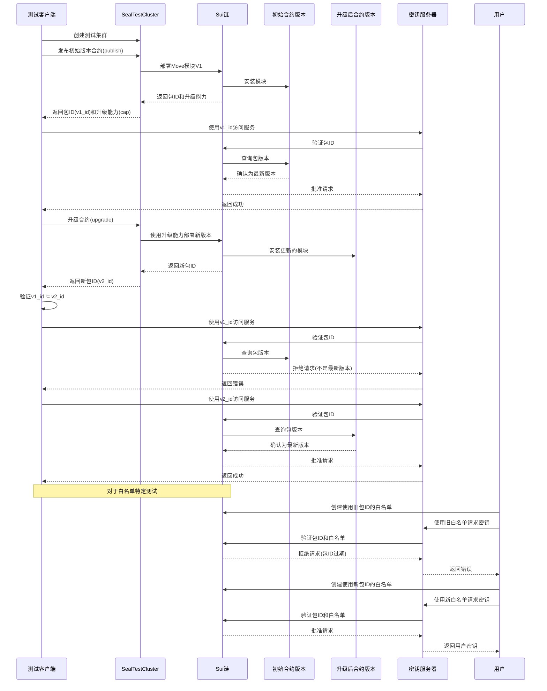
```mermaid
sequenceDiagram
    participant TC as 测试客户端
    participant Cluster as SealTestCluster
    participant Chain as Sui链
    participant ModV1 as 初始合约版本
    participant ModV2 as 升级后合约版本
    participant KS as 密钥服务器
    participant User as 用户
    
    TC->>Cluster: 创建测试集群
    
    TC->>Cluster: 发布初始版本合约(publish)
    Cluster->>Chain: 部署Move模块V1
    Chain->>ModV1: 安装模块
    Chain-->>Cluster: 返回包ID和升级能力
    Cluster-->>TC: 返回包ID(v1_id)和升级能力(cap)
    
    TC->>KS: 使用v1_id访问服务
    KS->>Chain: 验证包ID
    Chain->>ModV1: 查询包版本
    ModV1-->>Chain: 确认为最新版本
    Chain-->>KS: 批准请求
    KS-->>TC: 返回成功
    
    TC->>Cluster: 升级合约(upgrade)
    Cluster->>Chain: 使用升级能力部署新版本
    Chain->>ModV2: 安装更新的模块
    Chain-->>Cluster: 返回新包ID
    Cluster-->>TC: 返回新包ID(v2_id)
    
    TC->>TC: 验证v1_id != v2_id
    
    TC->>KS: 使用v1_id访问服务
    KS->>Chain: 验证包ID
    Chain->>ModV1: 查询包版本
    Chain-->>KS: 拒绝请求(不是最新版本)
    KS-->>TC: 返回错误
    
    TC->>KS: 使用v2_id访问服务
    KS->>Chain: 验证包ID
    Chain->>ModV2: 查询包版本
    ModV2-->>Chain: 确认为最新版本
    Chain-->>KS: 批准请求
    KS-->>TC: 返回成功
    
    note over TC,Chain: 对于白名单特定测试
    
    User->>Chain: 创建使用旧包ID的白名单
    User->>KS: 使用旧白名单请求密钥
    KS->>Chain: 验证包ID和白名单
    Chain-->>KS: 拒绝请求(包ID过期)
    KS-->>User: 返回错误
    
    User->>Chain: 创建使用新包ID的白名单
    User->>KS: 使用新白名单请求密钥
    KS->>Chain: 验证包ID和白名单
    Chain-->>KS: 批准请求
    KS-->>User: 返回用户密钥
```

## 测试辅助工具

`externals.rs` 提供了一系列辅助函数，用于与密钥服务器交互：
- `ptb_to_base64`：将可编程事务转换为 Base64 编码的字符串
- `sign`：为请求生成证书和签名
- `get_key`：从密钥服务器获取密钥

**辅助工具流程图**：

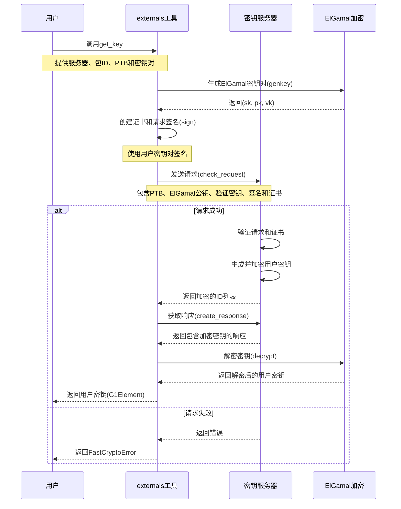
```mermaid
sequenceDiagram
    participant User as 用户
    participant EXT as externals工具
    participant KS as 密钥服务器
    participant ElG as ElGamal加密
    
    User->>EXT: 调用get_key
    Note over User,EXT: 提供服务器、包ID、PTB和密钥对
    
    EXT->>ElG: 生成ElGamal密钥对(genkey)
    ElG-->>EXT: 返回(sk, pk, vk)
    
    EXT->>EXT: 创建证书和请求签名(sign)
    Note over EXT: 使用用户密钥对签名
    
    EXT->>KS: 发送请求(check_request)
    Note over EXT,KS: 包含PTB、ElGamal公钥、验证密钥、签名和证书
    
    alt 请求成功
        KS->>KS: 验证请求和证书
        KS->>KS: 生成并加密用户密钥
        KS-->>EXT: 返回加密的ID列表
        EXT->>KS: 获取响应(create_response)
        KS-->>EXT: 返回包含加密密钥的响应
        EXT->>ElG: 解密密钥(decrypt)
        ElG-->>EXT: 返回解密后的用户密钥
        EXT-->>User: 返回用户密钥(G1Element)
    else 请求失败
        KS-->>EXT: 返回错误
        EXT-->>User: 返回FastCryptoError
    end
```

## 测试架构

### 核心结构体

1. **SealTestCluster**
   - 管理测试集群、服务器和用户
   - 提供合约发布和升级功能
   - 支持密钥服务器注册和查询

2. **SealKeyServer**
   - 包含服务器实例和 IBE 公钥
   - 维护服务器状态和密钥信息

3. **SealUser**
   - 表示测试用户
   - 包含用户地址和 Ed25519 密钥对

### 测试流程图

#### 1. 密钥服务器测试模块泳道图

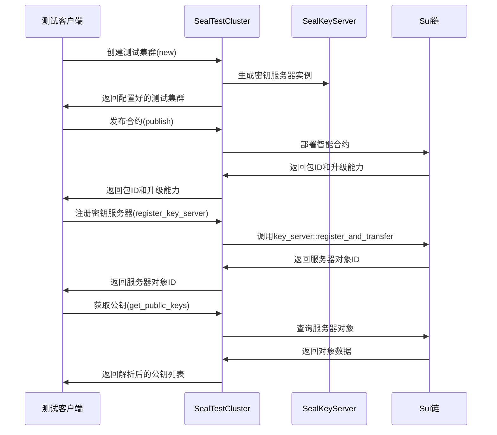
```mermaid
sequenceDiagram
    participant Client as 测试客户端
    participant TestCluster as SealTestCluster
    participant Server as SealKeyServer
    participant Chain as Sui链
    
    Client->>TestCluster: 创建测试集群(new)
    TestCluster->>Server: 生成密钥服务器实例
    TestCluster->>Client: 返回配置好的测试集群
    
    Client->>TestCluster: 发布合约(publish)
    TestCluster->>Chain: 部署智能合约
    Chain->>TestCluster: 返回包ID和升级能力
    TestCluster->>Client: 返回包ID和升级能力
    
    Client->>TestCluster: 注册密钥服务器(register_key_server)
    TestCluster->>Chain: 调用key_server::register_and_transfer
    Chain->>TestCluster: 返回服务器对象ID
    TestCluster->>Client: 返回服务器对象ID
    
    Client->>TestCluster: 获取公钥(get_public_keys)
    TestCluster->>Chain: 查询服务器对象
    Chain->>TestCluster: 返回对象数据
    TestCluster->>Client: 返回解析后的公钥列表
```

#### 2. 端到端加密解密流程

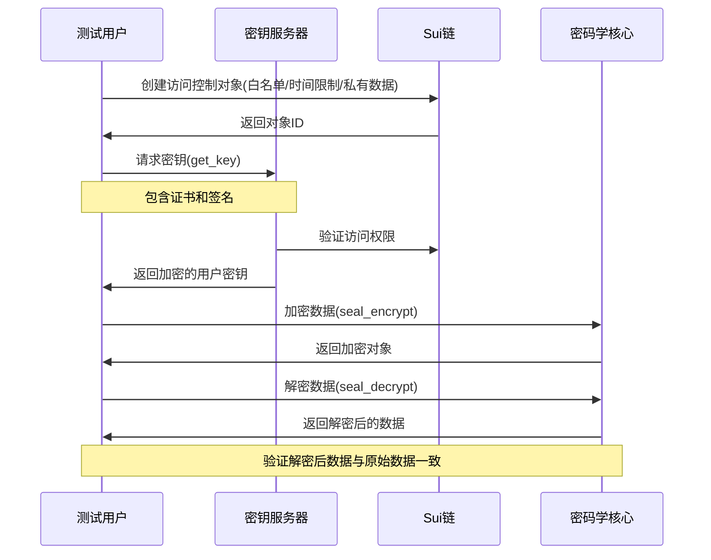
```mermaid
sequenceDiagram
    participant User as 测试用户
    participant KeyServer as 密钥服务器
    participant Chain as Sui链
    participant Crypto as 密码学核心
    
    User->>Chain: 创建访问控制对象(白名单/时间限制/私有数据)
    Chain->>User: 返回对象ID
    
    User->>KeyServer: 请求密钥(get_key)
    Note over User,KeyServer: 包含证书和签名
    KeyServer->>Chain: 验证访问权限
    KeyServer->>User: 返回加密的用户密钥
    
    User->>Crypto: 加密数据(seal_encrypt)
    Crypto->>User: 返回加密对象
    
    User->>Crypto: 解密数据(seal_decrypt)
    Crypto->>User: 返回解密后的数据
    
    Note over User,Crypto: 验证解密后数据与原始数据一致
```

#### 3. 所有访问控制模式验证流程

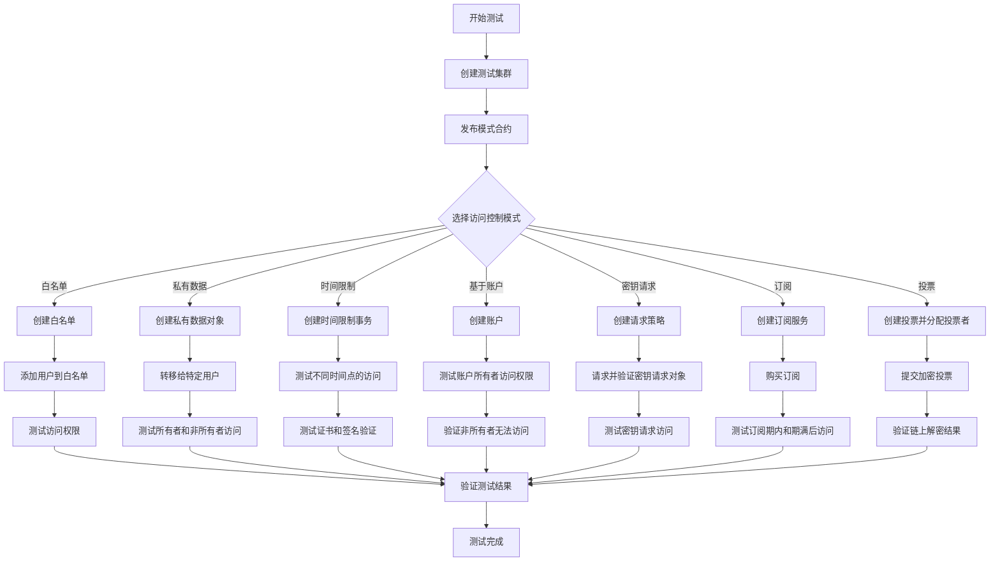
```mermaid
flowchart TD
    A[开始测试] --> B[创建测试集群]
    B --> C[发布模式合约]
    C --> D{选择访问控制模式}
    
    D -->|白名单| E1[创建白名单]
    E1 --> F1[添加用户到白名单]
    F1 --> G1[测试访问权限]
    
    D -->|私有数据| E2[创建私有数据对象]
    E2 --> F2[转移给特定用户]
    F2 --> G2[测试所有者和非所有者访问]
    
    D -->|时间限制| E3[创建时间限制事务]
    E3 --> F3[测试不同时间点的访问]
    F3 --> G3[测试证书和签名验证]
    
    D -->|基于账户| E4[创建账户]
    E4 --> F4[测试账户所有者访问权限]
    F4 --> G4[验证非所有者无法访问]
    
    D -->|密钥请求| E5[创建请求策略]
    E5 --> F5[请求并验证密钥请求对象]
    F5 --> G5[测试密钥请求访问]
    
    D -->|订阅| E6[创建订阅服务]
    E6 --> F6[购买订阅]
    F6 --> G6[测试订阅期内和期满后访问]
    
    D -->|投票| E7[创建投票并分配投票者]
    E7 --> F7[提交加密投票]
    F7 --> G7[验证链上解密结果]
    
    G1 --> H[验证测试结果]
    G2 --> H
    G3 --> H
    G4 --> H
    G5 --> H
    G6 --> H
    G7 --> H
    H --> I[测试完成]
```

## 如何编写新的测试

要为 Seal 密钥服务器添加新的测试，请遵循以下步骤：

1. **确定测试类型**：确定要测试的功能或特性。

2. **创建测试文件**：如果测试属于现有类别，可以将其添加到对应文件中；否则创建新的测试文件并在 `mod.rs` 中声明。

3. **使用测试框架**：利用 `SealTestCluster` 创建所需的测试环境：
   ```rust
   let mut tc = SealTestCluster::new(servers_count, users_count).await;
   let (package_id, _) = tc.publish("patterns").await;
   ```

4. **实现测试逻辑**：实现具体的测试逻辑，包括创建必要的对象、构建请求和验证结果：
   ```rust
   // 构建请求
   let ptb = construct_test_ptb();
   
   // 验证预期行为
   assert!(get_key(tc.server(), &package_id, ptb, &tc.users[0].keypair)
      .await
      .is_ok());
   ```

5. **添加断言**：为测试添加适当的断言，验证系统行为是否符合预期。